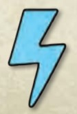

### VERSION 14 - DECEMBER, 2020

* [Introduction](#intro)
* [Rules](#rules)
* [Glossary](#glossary)
* [Errata](#errata)
* [FAQ](#faq)
* [Link to the Rules-PDF](https://images-cdn.fantasyflightgames.com/filer_public/8c/af/8cafeca4-02c3-4990-bba1-ff9d3aa8f02a/keyforge_rulebook_v14_reduced-compressed.pdf)
* [Look up deck rating](/awp.html)

# Introduction

## WELCOME TO THE CRUCIBLE…

_You are an Archon. Hailed by some as a god, respected by others for
your wisdom, you were born — or perhaps created — on the Crucible, a
world in which anything is possible._

_The Crucible is ancient, but ever renewed. An artificial planet hanging in
the center of the universe, the Crucible’s many layers remain constantly
under construction by the enigmatic and mischievous Architects. For raw
materials, the Architects have harvested countless worlds, blending them
into a new whole both familiar and alien to the creatures that dwell there.
Whether lone specimens or entire cultures, the beings brought to the
Crucible find themselves in a strange wonderland with no obvious means
of returning to their former homes. Some thrive, building new societies
and developing new technologies with the aid of the mysterious psychic
substance known as Æmber. Some discard the trappings of their old
lives, adopting the ways and customs of new tribes discovered in this new
world. Others devolve, bodies and minds twisted beyond all recognition,
incorporating Æmber into their very bodies._

_As an Archon, you have gathered followers in your journeys throughout
the Crucible, allies who find value in your ageless wisdom and your
ability to speak to all creatures. With the aid of these allies, you seek
out Vaults hidden throughout the Crucible by the cryptic Architects.
Each Vault can only be unlocked by Æmber-forged keys. Once open, a
Vault’s contents — the power and knowledge of the Architects — can be
consumed by only a single Archon._

_When two Archons discover a Vault, only one can gain its knowledge.
Only one can move one step closer to the secret of the Crucible…_

### OVERVIEW

_KeyForge_ is a two-player card game in which each player takes the role
of an Archon, and leads that Archon’s deck against their opponent.

A player’s deck represents a team that is attempting to gain Æmber and
forge keys. The first player to gather three keys is able to unlock a Vault
and win the game.

The defining feature of _KeyForge_ is that no two decks are alike. This is
not a trading card game — you cannot craft a deck. Rather, each deck
must remain as it is. Every deck in existence is unique!

## USING THIS DOCUMENT

If you have never played a game of KeyForge before, start by using the
Quickstart document included in the starter set to learn the basics of
the game.

After playing a game using the Quickstart, players can read the full rules
in this document and learn more about the _KeyForge_ setting.

In addition to rules and setting information, this document includes a
Glossary of important game concepts and terminology that will be useful
while interpreting card abilities.

# RULES

## KEY CONCEPTS

This section introduces a number of foundational concepts to keep in
mind while playing the game.

### THE GOLDEN RULE

If the text of a card directly contradicts the text of the rules, the text of
the card takes precedence.

### OBJECTIVE

During the game, players use their cards to collect Æmber. Players use
Æmber to forge keys. The game ends immediately when a player forges
their third key, and that player wins the game.

### READY AND EXHAUSTED

Cards that are in play exist in one of two states.

**Ready** cards are oriented upright so that their text may be read from left
to right. A ready card can be used during a player’s turn, causing it to
exhaust.

**Exhausted** cards are rotated 90 degrees to the side. An exhausted card
is not able to be used until it is readied by a game step or card ability.

**All creatures and artifacts enter play exhausted.**

### RUNNING OUT OF TOKENS OR STATUS CARDS
There is no limit to the number of damage tokens, Æmber tokens, or
status cards that can be in the game area at a given time. If there is a
shortage of the provided tokens or status cards, other tokens, counters,
or coins may be used to track the game state.

## GAME SETUP

To set up the game, perform the following steps, in order:

1. Place all damage tokens, Æmber tokens, and status cards in a common
supply within easy reach of both players.
2. Each player places their identity card to the left or right side of their
play area.
3. Each player places three key tokens, one of each color, with the
unforged side faceup near their identity card.
4. Randomly determine who is the first player. That player takes the first
turn when the game begins. (If players are playing a series of games
between two decks, in each game after the first, the player who used
the deck that was defeated in the previous game chooses who is the
first player.)
5. Each player shuffles their deck and offers it to the opponent for
additional shuffling and/or a final cut.
6. The first player draws a starting hand of seven cards. The other player
draws a starting hand of six cards.
7. Each player, starting with the first player, has one opportunity to
mulligan their starting hand by shuffling it back into their deck and
drawing a new starting hand with one fewer card in it. (This step is
skipped in the Quickstart game.)

The game is now ready to begin.

## TURN SEQUENCE

The game is played over a series of turns. Players alternate taking turns
until one player wins the game.

Each turn consists of five steps:

1. Forge a key.
2. Choose a house.
3. Play, discard, and use cards of the chosen house.
4. Ready cards.
5. Draw cards.

The player taking a turn is referred to as the **active player**. The active
player is the only player that can perform actions or make decisions; a
player does not make any decisions when it is not their turn.

Each step is described in the following sections.

### STEP 1: FORGE A KEY

If the active player has enough Æmber to forge a key during this step,
they must do so. To forge a key, the active player spends Æmber from
the Æmber pool on their identity card, returning it to the common
supply. Then, that player flips any one of their key tokens over to its
forged side, indicating that the key has been forged.

* **The default cost to forge a key is six Æmber**. Some card abilities
	may increase or decrease this number.
*	No more than one key can be forged during this step each turn, even
	if the active player has enough Æmber to forge multiple keys.
*	Some cards have effects that allow Æmber on these cards to be
	spent when forging keys. If there is enough Æmber on cards with this

### STEP 2: CHOOSE A HOUSE

Each _KeyForge_ deck is composed of three different houses, which are
shown on the identity card. During this step, the active player chooses
one of the houses on their identity card to activate, making it the active
house for the remainder of the turn. This **active house** determines
which cards the active player can play, discard from their hand, and use
this turn.

* After choosing a house, the active player has the option to take all
cards in their archives and add them to their hand. (See “[Archives”](#archives) in 
the Glossary.)
* If a player controls a card that does not belong to one of the three
houses on their identity card, they may (if they desire) choose and
activate that house during this step instead of one of the three
houses in their deck.
* A player cannot choose to activate a house unless it is either on
their identity card or they control a card that belongs to that house.
If a card effect instructs a player that they must activate a house
other than one in the aforementioned categories, that card effect is
ignored (See [Cannot VS Must/May](#cannot_vs_must).)

### STEP 3: PLAY, DISCARD, AND USE CARDS OF THE CHOSEN HOUSE
The active player may play or discard any number of cards of the active
house from their hand and may use any number of cards of the active
house that are in play under their control. Eligible cards may be played,
used, or discarded in any order.

A card’s house is determined by an icon in the
upper-left corner. If the active house corresponds
to a card’s icon, that card is eligible to be played,
used, or discarded.

Rules for playing, discarding, and using cards are described later.

* **First Turn Rule**: During the first player’s first
turn of the game, that player cannot play or
discard more than one card from their hand.
Card effects can modify this rule.
* The active player may not play, use, or discard cards that aren’t of the
active house unless specified by a card ability.

### STEP 4: READY CARDS

The active player readies each of their exhausted cards.

### STEP 5: DRAW CARDS

The active player draws cards from the top of their deck until they have
six cards in their hand. After a player completes this step, their turn ends.

* If the active player has more than six cards in hand, they do not
discard down to six.
* If a player needs to draw cards (during this step or at any other time)
and cannot because their deck is empty, that player shuffles their
discard pile to reset their deck, and then continues to draw (cards are
drawn one at a time).
* When a player’s turn ends, if that player has enough Æmber in their
pool to afford a key, the player announces “Check!” so that their
opponent knows the forging of a key at the start of that player’s next
turn is imminent.

## PLAYING CARDS

The active player is permitted to play any number of cards that belong to
the active house during step three of their turn

#### ÆMBER BONUS

Many cards in the game have an Æmber bonus below the house icon.
When a card with an Æmber bonus is played, the first thing the active
player does is gain that much Æmber. Each time a player gains Æmber
(for any reason), the Æmber is placed in that player’s Æmber pool (on
their identity card).

#### PLAY ABILITIES

Some cards have a bold **“Play**:” ability. Such abilities resolve after
the card’s Æmber bonus is collected, if it has any, and after the card
enters play.

### CARD TYPES

There are four types of cards in the game: action cards, artifacts,
creatures, and upgrades. There are different rules describing how each
card type is played.

#### ACTION CARDS

When an action card is played, the active
player resolves the card’s **“Play**:” ability
and, after resolving as much of the ability
as possible, places the card in their
discard pile.

### ARTIFACTS

Artifacts enter play exhausted and are
placed in a row in front of the player but
behind that player’s battleline, which is
explained on the next page. Artifacts
remain in play from turn to turn.

#### CREATURES

Creatures enter play exhausted and are placed in the front row of
the active player’s play area. This row is referred to as the battleline.
Creatures remain in play from turn to turn, and they each have
power and armor values that they use to resolve fights, which are
described later.

Each time a creature enters play, it must be placed on a flank — at the
far left or the far right of its controller’s battleline. Each time a creature
leaves play, shift the battleline inward to close the gap.

#### UPGRADES

Upgrades enter play attached to (i.e., partially overlapped by) a creature
chosen by the player who controls the upgrade. Each upgrade remains in
play from turn to turn and modifies the card to which it is attached.

* If the card to which an upgrade is attached leaves play or become a
non-creature, the upgrade is discarded.
* If an upgrade cannot attach to a card in play, the upgrade cannot
enter play.

### DISCARDING CARDS

The active player can discard from their hand any number of cards from
the active house during step three of their turn. Cards are discarded one
at a time, at any point throughout this step. This lets players remove
cards that they do not want to play from their hand, freeing up space to
draw more cards at the end of the turn.

### USING CARDS

The active player can use any number of cards from the active house that
they have in play during step three of their turn. Depending on a card’s
type, the active player is able to do different things when using that card

#### UPGRADES

An upgrade modifies the creature it is attached to and is not used
independently of that creature.

#### USING ARTIFACTS

There are two types of abilities that enable a player to use an artifact:
**“Action**:” abilities and **“Omni**:” abilities

* When a player uses an artifact, they exhaust the card and then
resolve its abilities.
* A player can only use an **“Action**:” ability if it is on a card that
belongs to the active house.
* A player can resolve an **“Omni**:” ability even if it is on a card that
does **not** belong to the active house.
* Some artifacts require that they be sacrificed as part of the cost of
using them. When an artifact is sacrificed, it is placed in its owner’s
discard pile. A player must still exhaust such an artifact when using it.
* Artifacts cannot be used to reap or to fight.

#### USING CREATURES

When a player uses a creature, that player must exhaust the creature,
and the player has the option to reap, fight, trigger the creature’s
**“Action**:” ability, or trigger the creature’s **“Omni**:” ability. Any card effect
that causes a creature to fight, reap, trigger its **“Action**:” ability, or to
trigger it’s **“Omni**:” ability is causing that creature to be used.

##### REAP

**Any ready creature of the active house may reap**. When a
creature is used to reap, the creature exhausts and its controller
gains 1 Æmber for their Æmber pool. Then, all **“Reap**:” abilities the
creature has, if it has any, resolve

##### FIGHT

**Any ready creature of the active house may fight**. When a creature
is used to fight, the creature exhausts and its controller chooses one
eligible creature controlled by the opponent to be fought. Each of
the two creatures deals an amount of damage equal to its power (the
value to the left of the card’s title) to the other creature. All of this
damage is dealt simultaneously. After the fight resolves, if the creature
that is being used to fight survives, all **“Fight**:” abilities the creature
has, if it has any, resolve.
A creature cannot fight if there are no enemy creatures to be fought.

A creature cannot fight if there is no enemy creature that can be
chosen as the target of the attack.

##### ACTION

**Any ready creature of the active house may trigger its “Action:”
ability, if it has one**. When a creature is used to trigger its **“Action:**”
ability, the creature exhausts and that “**Action:**” ability resolves.

##### OMNI

**Any ready creature may trigger its “**Omni:**” ability, if it has one**,
even if it does not belong to the active house. When a creature is
used to trigger its “**Omni:**” ability, the creature exhausts and that
“**Omni:**” ability resolves

#### DAMAGE AND ARMOR

When a creature is dealt damage, place an amount of damage tokens
equal to the amount of damage dealt on the creature. If a creature has as
much or more damage on it as it has power, the creature is destroyed and
placed on top of its owner’s discard pile. If a creature has an armor value
(to the right of the card’s title), the armor prevents that much incoming
damage each turn. (For more details, see “[Armor](#armor)” in the Glossary.)

* When a creature leaves play, any Æmber on that creature is gained
by the opponent. (See “[Capture](#capture)” in the Glossary.)

#### COMBAT EXAMPLE

### CARD ABILITIES

Unless otherwise specified by the ability, the active player makes all
decisions while resolving an ability.

For details on specific terminology that can be found in card ability text,
see the [Glossary](#glossary).

#### RESOLVE AS MUCH AS YOU CAN

While resolving a card ability, resolve as much of the ability as can be
resolved, and ignore any parts of the ability that cannot be resolved.

_**Example**: Aaron plays the card Anger (COTA 001), that reads “**Play:**
Ready and fight with a friendly creature.”, and chooses his friendly
Snufflegator (COTA 358) to resolve the ability on. However, the
Snufflegator is already ready, so Aaron ignores that part of the ability and
just uses his friendly Snufflegator to fight._

#### RESOLVE ABILITIES IN THE ORDER THEY ARE WRITTEN

While resolving the text of a card ability, fulfill the instructions of
that ability in the order the text is written. This may be modified by
replacement effects, including replacement effects which appear later in
the ability that is being resolved.

_**Example:** Hyde (WC 167) has the text: “**Reap:** Draw a card. If you control
Velum, draw 2 cards instead.” The later text applies a replacement effect
for the earlier text, altering how it resolves._

However, all damage dealt by a card’s ability is dealt simultaneously
regardless of where it appears in the ability’s text.

_**Example:** Mighty Lance (CotA 221) has the text: “**Play**: Deal 3 :face_with_head_bandage: to a
creature and 3 :face_with_head_bandage: to a neighbor of that creature.” That damage to both
creatures is dealt simultaneously even though it appears twice in the
ability’s text._

#### USING CARDS VIA OTHER CARD ABILITIES

If a card ability allows a player to play or use another card (or to fight or
to reap with a card), the chosen card may belong to any house unless the
ability specifically states otherwise.

* When using a card via a card ability, any other requirements of using
the card (such as exhausting to reap, fight, or resolve its “Action:”
ability) must be observed, or the card cannot be used.
* Players can only use cards they control, unless a card ability
specifically states otherwise.

#### THE RULE OF SIX

Occasionally, a situation may emerge in which, through a combination
of abilities, the same card may be played or used repeatedly during the
same turn. A player cannot **play and/or use** the same card and/or other
copies of that card (by title) more than **six times** during a given turn.

#### CONSTANT ABILITIES

If a card has an ability that does not have
a boldfaced precursor, the ability is a
constant ability that is active so long as
the card remains in play and meets all
conditions specified by the ability.

* Constant abilities on a card are active
even while that card is exhausted.
* Applying the effects of a constant
ability is not considered using a card
and therefore does not cause the card
to exhaust.

### CHAINS

Chains represent supernatural bindings that are occasionally placed
onto specific Archons by the Architects: sometimes in an effort to better
challenge the Archon to grow and overcome greater adversity, and
other times to penalize the Archon for breaking a rule or a piece of
Crucible etiquette.

A player may gain chains through card abilities during a game. When
a player gains chains, that player increases their chain tracker by the
number of chains gained.

Each time (including during setup) a player with one or more chains would
draw one or more cards to refill their hand, that player draws fewer cards
(based on their current chain level, see below) and then sheds one chain
by reducing their chain tracker by one.

The more chains a player has, the greater the card penalty becomes.

* Chains 1–6: draw 1 fewer card.
* Chains 7–12: draw 2 fewer cards.
* Chains 13–18: draw 3 fewer cards.
* Chains 19–24: draw 4 fewer cards.

**Example:** Tori has been assigned seven chains. During setup, Tori will
draw two fewer cards and shed a chain. Then, the next six times Tori
refills her hand, she will draw up to five cards and shed another chain.
After all of her chains have been shed, Tori will draw to the standard
hand size.

#### CHAIN HANDICAPS (OPTIONAL)

When playing a game between a weaker deck and a stronger
deck, players may use chains as a means to handicap the stronger
deck. Chains are used when players want a fair game between two
known decks rather than a potentially unfair competition between decks
that aren’t known. When playing with new decks, or competing in a
tournament, players will not use this handicap.

##### SUGGESTIONS FOR ASSIGNING CHAINS

When the players have a sense that a particular deck is stronger than
the opposing deck, start it with four chains. From then on, every time
the chained deck wins three games in a row against that opposing
deck, adjust the number of chains up by one, and if it loses three
games in a row, adjust the number of chains down by one.

As a player plays more games with their collection, the number of
chains assigned to a deck will fluctuate up and down based on the
matchup and how well the deck has performed against the opposing
deck.

##### CHAIN BIDDING

If players are reasonably familiar with two decks they can ignore the
suggested number of chains, and instead bid a number of chains for
the right to use a particular deck.

_**Example:** Terry and Julie decide to play Mother Mahospot against
Chancellor Fisher. Mother Mahospot is a deck that both players are
very familiar with, feel is quite strong, and enjoy playing. Chancellor
Fisher is a newer deck, that the players are not as comfortable
playing. The above guidelines suggest they begin with four chains
on Mother Mahospot. Julie looks at Fisher, considers a moment, and
says, “I’ll play Mother Mahospot at five.” Terry raises to six. Julie
goes to seven. Terry decides to let her play it at seven, and plays
Chancellor Fisher._

### WHAT’S NEXT

You are now familiar with the basic rules of the game. The next section
of this book contains a Glossary of advanced concepts that can be
referenced while playing or interpreting card abilities.

_[...]_

# GLOSSARY

This Glossary includes a number of concepts and terms players may
encounter while playing the game, in alphabetical order. Instead of
reading this section from beginning to end, players are encouraged to
only look up new concepts as they are encountered during play.

### ABILITY, CARD ABILITY

An ability is the special game text a card contributes to the game.

Unless an ability explicitly references an out-of-play area (such as a hand,
deck, archives, or discard pile), that ability can only interact with cards
that are in play. Abilities that interact with a card after it is destroyed can
interact with that card while it is in the discard pile.

Abilities on a creature, artifact, or upgrade are only active (and can
only be triggered) while that card is in play, unless the ability explicitly
references being used from an out-of-play area. Once an ability on a card
has been triggered, that ability will finish resolving even if the card leaves
play.

If resolving part of the instructions of a card ability causes other card
effects to trigger, resolve those other card effects before continuing to
resolve the instructions of the first card.

### ACTION ABILITY

To use an **“Action:”** ability during their turn, the active player must
exhaust the card. The ability then resolves.

### ACTIVE HOUSE

The active house is the house that the active player has chosen for the
current turn.

### ACTIVE PLAYER

The active player is the player taking the current turn. Unless otherwise
specified by the card's ability, the active player makes all necessary
decisions for all card abilities. Whenever multiple effects happen at the
same timing point, the active player decides the order in which those
effects resolve.

### ADJACENT

When a creature card refers to a game element as being “adjacent” to
that creature or being played “adjacent” to that creature, it is referring to
a card being in or being played into the position to the immediate right
or immediate left of that creature.

See also “[Neighboring](#neighbor)”

### ÆMBER

Æmber is tracked by Æmber tokens, and is used to
forge keys.

Only Æmber in your own Æmber pool is considered “yours” for the purpose of card effects.

See also: [Capture](#capture), [Keys](#keys), [Reap](#reap), [Steal](#steal).

### ÆMBER BONUS ICON :trophy:

See "[Bonus Icons](#bonus_icons)" on page 9.

### ALPHA

When a card has the Alpha keyword, it can only be played if you haven’t
played, used, or discarded any other cards during step 3 of your turn. 

### ANOMALY

This symbol indicates that a card is an anomaly card. An
anomaly card is an extremely rare card that is a preview
of possible future sets of _KeyForge_. An anomaly card may
appear in any house, and is treated as belonging to that
house for all game purposes.

### ARCHIVES

A player’s archives is a facedown game area in front of that player’s
identity card. Card abilities are the only means by which a player is
permitted to add cards to their archives. During step 2 of a player’s turn,
after they select an active house, the active player is permitted to pick up
all cards in their archives and add those cards to their hand.

Cards in a player’s archives are considered out of play.

A player may look at their archives at any time. A player is not permitted
to look at an opponent’s archives.

If the ability instructing a player to archive a card does not specify where
the card is archived from, the archived card comes from that player’s hand.
If an ability “puts” a card into a player's archives, abilities that trigger
when a card is archived will not trigger.

### ARMOR

Some creatures have an armor value to the right of the card title. Armor
prevents an amount of damage equal to the armor value that the creature
would take each turn. Armor prevents damage before it is actually dealt.
For example, if a creature has two armor and is dealt one damage, that
damage is instead prevented by the armor, leaving the creature with
one armor that can prevent damage left for the rest of the turn. If the
creature is later dealt three more damage during that turn, one damage is
prevented and the other two damage are dealt to that creature.

If a creature gains armor, the gains are additive and accumulate on top of
the creature’s printed armor value.

If a creature gains armor during a turn, the gained armor does not
prevent damage already dealt that turn. If a creature loses armor during
a turn, it is not retroactively dealt damage that was already prevented by
the armor.

If a creature loses any amount of armor, it loses armor that has been
used to prevent damage this turn before it loses armor that has not been
used to prevent damage this turn.

If a creature has a “~” symbol in its armor field, the creature has no
armor. Such creatures may gain armor through card effects.

### AS IF IT WERE YOURS/AS IF YOU CONTROLLED IT

If a card effect instructs you to use a card “as if it were yours” or “as if
you controlled it,” it causes you to use the card even if you don’t control
it. You never gain control of the card during this process, but you resolve
the effect as if you controlled the card.

When using a card “as if it were yours/as if you controlled it” that
instructs you to sacrifice the card as part of the effect, the card is still
sacrificed as if you controlled it.

### ASSAULT (X)

When a creature with the assault (X) keyword is used to fight, it deals
damage equal to its assault value (i.e., “X”) to the creature it is fighting
before the fight resolves. (The active player chooses whether this
occurs before or after other “Before Fight” effects and keywords.) If this
damage destroys the other creature, the rest of the fight does not occur.

If a creature with the assault (X) keyword gains another instance of the
assault (X) keyword, the two X values are added together.

### ATTACK, ATTACKER, ATTACKING

See “[Fight](#fight)” on page 10.

### BATTLELINE

The battleline is the ordered line of creatures a player controls in play.
See “[Creatures](#creatures)” on page 6.

### BEFORE

If the word “before” is used in an ability (for example, **“Before Reap:”** or
**“Before Fight:”**), that ability resolves before resolving the game effect of
the reap or fight (but after the card exhausts, if exhausting is required to
use the card).

### BONUS ICONS

Many cards have one or more bonus icons in the upper-left corner, below
the house icon. After a card with a bonus icon is played, the first thing
the active player does is resolve each bonus icon on that card. These
icons are resolved after the card enters play (if it is an artifact, creature,
or upgrade), but before resolving any “**Play:**” abilities on that card or any
abilities that trigger “after” that card is played.

Bonus icons must be resolved in the order printed on the card, from top
to bottom. Resolving each bonus icon is mandatory.
There are four types of bonus icons:

**Æmber** ( :trophy: ): Gain 1 Æmber.

**Capture** ( :no_entry_sign: ): A friendly creature captures 1 Æmber from the opponent.
This Æmber may be captured by any friendly creature, including the
creature with the capture icon. If a card has multiple capture icons, the
captured Æmber may be distributed among multiple creatures.

**Damage** ( :face_with_head_bandage: ): Deal 1 damage to a creature in play. This damage may
be dealt to the creature with the damage icon. Note that if there are
no enemy creatures in play, this damage must be dealt to a friendly
creature. If a card has multiple damage icons, each damage icon is
resolved separately, one at a time, and the damage may be distributed
among multiple creatures. Damage dealt by a bonus icon is not
considered to be dealt by the card on which the icon appears.

**Draw** ( :card_index: ): Draw 1 card

### CANNOT VS MUST/MAY, CANNOT VS PERMISSIVE

If two card effects are simultaneously instructing a player that they
“cannot” do something and that they “must” or “may” do the same
thing, the “cannot” effect takes precedence.

_**Example:** Anna controls a Pitlord (COTA 093) which reads “While
Pitlord is in play you must choose Dis as your active house.” On their
next turn Anna’s opponent plays Restringuntus (COTA 094) which reads
“**Play:** Choose a house. Your opponent cannot choose that house as
their active house until Restringuntus leaves play.” and chooses Dis
for its ability. On Anna’s next turn, she both must and cannot choose
Dis, but because cannot takes precedence over must, she only cannot
choose Dis and must choose one of her other houses instead._

If two card effects are simultaneously instructing a player that they
cannot do something and that they may do something, the “cannot”
effect takes precedence.

### CAPTURE

Captured Æmber is taken from an opponent’s Æmber pool and placed
on a creature controlled by the capturing player. Players may not spend
captured Æmber.

When a creature with Æmber on it leaves play, the Æmber is placed in
the opponent’s Æmber pool.

Unless otherwise specified, Æmber is placed on the creature that
captured it.

### CAPTURE BONUS ICON :no_entry_sign:

See "[Bonus Icons](#bonus_icons)" on page 9.

### CENTER OF THE BATTLELINE

A creature is in the center of the battleline when there are an equal
number of creatures to both that creature’s left and right side.
There is only a center of a battleline if there is an odd number of
creatures in that battleline. When there is an even number of creatures
in a battleline, there is no center. If there is only one creature in the
battleline that creature is in the center.

### CHAIN, CHAINS

Some card abilities cause a player to gain one or more chains. If a player
gains chains, that player increases their chain tracker by the number of
chains gained.

If a player has at least one chain when refilling their hand and would
draw cards based on the number of remaining cards in their hand, they
draw fewer cards according to the chart below. Then, they shed one
chain by reducing the number on their chain tracker by one.

* Chains 1-6: draw one fewer card.
* Chains 7-12: draw two fewer cards.
* Chains 13-18: draw three fewer cards.
* Chains 19-24: draw four fewer cards.

While drawing an initial hand of cards during setup, if a deck has chains
assigned to it, the chains also apply to the initial hand of cards drawn as
if you were refilling a hand during step 5. A chain is shed for this initial
draw as per the standard rules.

See “[Chains](#chains)” on page 8.

### CONTROL

A player owns the cards that begin the game in their deck. When a card
is played, it enters play under the control of the active player.

A player can take control of an opponent’s card. When this happens,
that card is placed in the new controller’s play area. If it is a creature, it is
placed on a flank of the new controller’s battleline. If multiple effects that
take control of a card are used on the same card, the most recent effect
takes precedence.

If a player takes control of a card that belongs to a house not in the new
controller’s deck, they can make that house the active house during step
2 of their turn.

If a card that has changed control leaves play for any reason, it moves to
its owner’s appropriate out-of-play zone.

If an ability refers to cards that a player “has” in play, it is referring to
cards that player controls.

### COST, AT CURRENT COST

The base cost to forge a key is six Æmber. This cost may be modified by
card abilities. The modified cost is referred to as the current cost.

### DAMAGE

Damage a creature has taken is tracked by placing damage tokens on
the creature. If a creature has an amount of damage on it equal to or
greater than its power, the creature is destroyed. Damage on a creature
does not reduce its power. If multiple creatures are damaged by a single
effect, that damage is dealt simultaneously.

For more details on [damage and combat](#damage_and_armor), see page 7.

### DAMAGE BONUS ICON :face_with_head_bandage:

See "[Bonus Icons](#bonus_icons)" on page 9

### DEPLOY

A creature with the deploy keyword does not need to be played on
the flank of its controller’s battleline. Instead, when it is played it can
be placed anywhere in its controller’s battleline, including between two
other creatures.

### DESTROYED

When a card is destroyed by a card effect or when a creature has
damage on it equal to or greater than its power, that card is tagged for
destruction. After it is tagged, then that card’s “**Destroyed:**” abilities
trigger, and finally the tagged card is placed into its owner’s discard pile.
If multiple cards are simultaneously tagged for destruction, the active
player chooses the order in which to resolve the “**Destroyed:**” abilities
of any of those cards. All the tagged cards are put into their
owners’ discard piles simultaneously, and the active player chooses the
order in which those cards are arranged in their owner’s discard piles.

Once a creature has been tagged for destruction, the only thing that can
remove this tag is a replacement effect that uses the word “instead” and
replaces the destruction of that creature. An effect that heals a tagged
creature does not remove the destroyed tag. An effect may move a
tagged creature to a different out-of-play area (such as the hand or
archives), but that creature is still considered to have been “destroyed”
for the purposes of card effects.

If a “**Destroyed:**” ability causes more cards to be destroyed, they are
also tagged for destruction, and their “**Destroyed:**” effects will also
trigger before cards are placed in the discard pile. None of the cards that
have been tagged for destruction are put into their owners’ discard piles
until all “**Destroyed:**” effects have finished resolving.

Players cannot choose to sacrifice or destroy a creature that is already
tagged for destruction. A card that is already tagged for destruction
cannot be tagged for destruction again, and any effect that attempts
to destroy or sacrifice that card fails. That card still only resolves its
“**Destroyed:**” abilities once.

A card only triggers “**Destroyed:**” abilities that it had at the time it was
tagged for destruction. If a card gains a “**Destroyed:**” ability after it is
already tagged, that ability does not trigger.

Cards that are sacrificed also count as being destroyed. They are tagged
for destruction following the same process outlined above.

_**Example:** Dan has Archimedes in the middle of 4 other creatures and
his opponent plays Gateway to Dis, destroying all creatures. First, all of
Dan’s creatures are tagged for destruction. Then Archimedes’ neighbors
“**Destroyed:**” effects resolve, archiving them. The battleline immediately
collapses, but Archimedes’ new neighbors have already been tagged
for destruction and cannot gain a new “**Destroyed:**” ability, so they are
placed in the discard pile along with Archimedes._

_**Example:** Emily has a Jehu the Bureaucrat, Duma the Martyr with 2
damage, and Commander Remiel with 1 damage in play. Her opponent
plays a Poison Wave, dealing 2 damage to each creature. This damage
causes Duma the Martyr and Commander Remiel to be tagged for
destruction. Duma the Martyr’s “**Destroyed:**” effect resolves, healing Jehu
the Bureaucrat and Commander Remiel. Since Commander Remiel was
already tagged for destruction, it still goes to the discard pile with Duma
the Martyr, but Jehu the Bureaucrat survives unscathed._

_**Example**: Marcus has a Groggins with a Phoenix Heart in play. His
opponent, Janelle, has a Dust Imp with a Soulkeeper, a Drumble, and a
Shaffles in play. Marcus fights Dust Imp with Groggins, causing Dust Imp
to be tagged for destruction. Dust Imp’s “**Destroyed:**” ability and the
“**Destroyed:**” ability that Soulkeeper grants it both trigger simultaneously.
Marcus chooses to let his opponent gain the 2 Æmber first, then resolve
the Soulkeeper, which will destroy Marcus’s most powerful creature—
Groggins. When Groggins is tagged for destruction, the Phoenix Heart
attached to it resolves, returning Groggins to Marcus’s hand and dealing
3 damage to each other creature. This damage then tags Drumble and
Shaffles for destruction. Finally, all the destroyed creatures still in play
(Dust Imp, Drumble, and Shaffles) are placed in their owner’s discard pile
in the order of the active player (Marcus’s) choice._

### DISCARD PILE

When a card is destroyed or discarded, it is placed on top of its owner’s
discard pile. The cards in each player’s discard pile are open information,
and may be referenced at any time.

The order of cards in a player’s discard pile is maintained during play,
unless a card ability causes this order to change.

When a player runs out of cards in their deck and are required to draw,
they shuffle their discard pile to create a new deck.

### DRAW BONUS ICON :card_index:

See "[Bonus Icons](#bonus_icons)" on page 9.

### ELUSIVE

The first time a creature with the elusive keyword is chosen to be fought
each turn, it is dealt no damage and deals no damage to the opposing
creature in the fight.

Elusive only stops damage that would be dealt by each creature’s power;
damage dealt by keywords or other abilities still applies.

### END OF TURN

End of turn effects are resolved when a player’s turn is over—after step 5,
the “Draw Cards” step.

### ENEMY

If a card ability refers to an “enemy” game element, it refers to an
element currently controlled by the opponent.

### ENHANCE

Each card with the Enhance keyword has added the indicated bonus
icons to random cards in your deck. (This has already happened during
the deck generation process.)

The enhance keyword has no effect during gameplay.

_**Example:** Mutant Cutpurse has “Enhance :face_with_head_bandage: :face_with_head_bandage: :face_with_head_bandage: ”. As a result,
three :face_with_head_bandage: bonus icons have been randomly added to cards in your
deck. The Mutant Cutpurse itself gets no special ability from Enhance
during gameplay._

Bonus icons that have been added by Enhance can be identified by the
graphical element shown here:

### ENRAGE

When a creature becomes enraged, place an enrage status counter on
it. When a creature with an enrage counter on it is used, it must be used
to fight, if able. After a creature with an enrage counter on it is used to
fight, remove all enrage counters from it.

While a creature has an enrage counter on it, it cannot be enraged again.

### EXALT

When an effect instructs you to “exalt” a creature, take 1 Æmber from
the common supply and place it on that creature.

Note: When a creature with Æmber on it leaves play, the Æmber is
placed in the opponent’s Æmber pool

### FIGHT

When a player uses a creature to fight, the player exhausts the creature
and chooses an opponent’s creature. Both creatures deal an amount of
damage equal to their power value to the opposing creature in the fight,
and both are “fighting” for the purposes of card effects.

After a creature is used to fight, if that creature survives the fight, all
**“Fight:**” abilities on that creature then resolve. If either creature in a fight
has a constant ability referencing the end of the fight (example: “after an
enemy creature is destroyed fighting this creature…”), the creature must
survive the fight to resolve the ability. "**Fight:**" abilities only trigger for the
creature that was used to fight, not for the other creature in the fight.

If either creature in a fight is destroyed while resolving Assault,
Hazardous, or "**Before Fight:**" abilities, then the fight (dealing damage
based on power) is skipped. The creatures are not considered to have
been in a fight for the purpose of card effects that reference “fighting”
or “in a fight”, and **“Fight:**” abilities will not trigger. Card effects that
reference “after a creature fights” or “after a creature is used” will still
trigger, as the creature was used to fight (even though the fight did not
resolve).

### “FIGHT WITH”

If an ability instructs a player to “fight with” or “ready and fight with”
a creature, the ability is granting the player permission to use the
designated creature to fight. The fight is resolved following the standard
rules for fighting, against a creature controlled by the opponent.

### FLANK

The creatures on the far right and far left of a player’s battleline are on
the flanks of the line. A creature in this position is referred to as a flank
creature. Any time a creature enters play or changes control, the active
player chooses which flank of its controller’s battleine it is placed on.

If a battleline only has one creature in it, that creature is on both the left
and right flank and is considered a flank creature.

### “FOR EACH”

Some abilities include an effect that uses the term “for each” to
determine the magnitude of the effect. Unless otherwise specified, a
player may choose to affect a different card with each instance of such
an effect.

_**Example:** Shard of Pain reads “Play: Deal 1 damage to an enemy
creature for each friendly Shard.” That damage may be distributed
among multiple creatures._

Some abilities specify that a player must “choose a creature,” then do an
effect to that creature using the term “for each.” Such abilities only affect
a single creature.

_**Example:** Red Planet Ray Gun reads “This creature gains, “Reap: Choose
a creature. Deal 1 damage to that creature for each Mars creature in
play.”” That damage must be dealt only to the chosen creature—it
cannot be distributed among multiple creatures._

### FORGE

For details on [forging keys](#forge_a_key), see page 4.

### FRIENDLY

If a card ability refers to a “friendly” game element, it refers to an
element currently under the control of the same player.

### GIGANTIC

Gigantic creatures are spread out over 2 cards, with one card containing
the creature’s text box and the other its art, as shown:

In order to play a gigantic creature, a player must have both halves of
the creature in hand, and play those cards together as a single creature.
The top half of a gigantic creature has the text “1 of 2” next to its title,
while its corresponding bottom half shares the same title and has the
text “2 of 2” next to its rarity icon.

A gigantic creature counts as 2 cards while out of play, but as a single
creature card while in play. Playing a gigantic creature only counts
as playing 1 card, and therefore it is allowed on the first turn. After
a gigantic creature leaves play, the 2 halves are treated as separate
cards again.

Both halves of a gigantic creature have the same title, house, and card
type. Otherwise, each half has the attributes printed on it: the top
half has bonus icons, while the bottom half has power, armor, and the
text box.

If a card instructing you to play or put into play a creature chooses one
half of a gigantic creature, that effect will fail. If a card instructs you to
play or put into play both halves of a gigantic creature, the gigantic
creature will be played or put into play.

_**Example:** Bella plays Wild Wormhole, allowing her to play the top card of
her deck. She looks at the top card and sees that it is the top half of Ultra
Gravitron. She cannot play that card from the top of her deck (even if she
has the other half of Ultra Gravitron in her hand), so the card is returned
to the top of her deck._

### GRAFT

If a card ability instructs you to graft a card onto another card, the card
being grafted is placed faceup under the other card. The grafted card
is not considered to be in play. If the card onto which it is grafted leaves
play, the grafted card is placed in its owner’s discard pile.

### HAUNTED

While a player has 10 or more cards in their discard pile, that player
is haunted. Being haunted has no inherent game effect, but it may be
referenced by card abilities.

### HAZARDOUS (X)

When a creature with the hazardous X keyword is chosen to be fought, it
deals X damage to the opposing creature before the fight resolves. (The
active player chooses whether this occurs before or after other “Before
Fight” effects and keywords.) If this damage destroys the other creature,
the rest of the fight does not occur.

If a creature with the hazardous (X) keyword gains another instance of the
hazardous (X) keyword, the two X values are added together.

### HEAL

If an ability “heals” a creature, remove the specified amount of damage
from the creature.

If an ability “fully heals” a creature, remove all damage from the creature.

Any creature can be chosen to be healed by a card effect that heals,
even if it does not have any damage on it. However, if no damage is
removed from the creature, it is not considered to have been “healed”
for the purpose of card effects that reference healing.

### HOUSE CHOICE

Each turn, a player must choose one of the three houses indicated by
their identity card, if able. Some card abilities may restrict a player’s
house choice.

If a player has gained control of a card that does not belong to one of
their three houses, that card’s house becomes an eligible choice for that
player while the player retains control of the card.

If there is no legal choice of house, the player plays the turn with no
active house.

If a player is faced with two (or more) “must choose” mandates, the
player may choose either of those options.

### “IF YOU DO” AND “IN ORDER TO”

If an ability includes the phrase “if you do” or “in order to,” the player
referenced by the ability must successfully and completely resolve the
text that precedes that phrase before they can resolve or perform the
text that follows that phrase. In other words, if the first part of the ability
is not successfully and completely resolved, that which follows the phrase
does not resolve or cannot be performed.

### INFINITE LOOPS

While most repeatable interactions involve playing or using cards, and
thus are limited by the Rule of Six, in very rare cases, an infinite loop
can happen where two or more card abilities will continue to trigger
each other repeatedly. In such cases, the active player simply chooses
how many times they want to resolve the loop, adjusts the game state
accordingly, and then stops resolving the loop so play can resume
as normal.

### INVULNERABLE

If a creature has the invulnerable keyword, it cannot be dealt damage
and cannot be destroyed.

A creature with invulnerable can leave play by means other than being
destroyed, such as being purged, archived, returned to hand, or shuffled
into its owner’s deck.

Because a creature with invulnerable cannot be destroyed, it remains in
play even if its power is 0.

### KEYS

The first player to forge all three of their keys immediately wins
the game.

Each player has one key of each color: red, blue, and yellow. Some card
abilities may reference the color of your keys, including which of your
keys are forged or unforged.

For details on [forging keys](#forge_a_key), see page 4.

### LASTING EFFECTS

Some card abilities create effects or conditions that affect the game for a
specified period of time, such as “until the start of your next turn” or “for
the remainder of the turn.” These are called lasting effects.

Lasting effects are treated as constant abilities that are active for the
duration specified by the effect. A lasting effect persists even if the card
that created the effect leaves play.

If a lasting effect affects cards in play, it applies to all cards in play during
the specified period, regardless of whether they were in play at the time
the lasting effect was established.

### LEGACY

This symbol indicates that a card is a legacy card. A legacy
card is a rare instance of a card that has been brought
forward from a previous set of _KeyForge_. It is legally part of
the deck it is in for all game purposes, including tournament
play.

### LEAST POWERFUL

A reference to the “least powerful” creature refers to the creature in play
with the lowest power. If there are multiple creatures that qualify, each is
considered “least powerful.”

If an ability requires the selection of a single least powerful creature, and
multiple creatures are tied, the active player chooses one.

#### Groups of “Least Powerful”

If a card effect refers to a group of “the X least powerful” creatures, it
is referring to a number of creatures in play that have an equal or lower
power than every creature that does not belong to that group. If there
are not enough creatures with the lowest power to fulfill the group,
then a creature with the next lowest power is eligible to be considered
a part of the group. This continues until the group has been filled or
there are no creatures remaining. If at any point multiple creatures
are tied at the same power that could qualify them for the group, but
there is not enough space in the group for each tied creature, the
active player chooses which of the tied creatures are part of the group.

### LEAVES PLAY

If a card that is in play leaves play (is returned to hand or deck,
destroyed, discarded, archived, or purged), all non-Æmber tokens and
status cards on the card are removed, all upgrades on the card are
discarded, and all lasting effects applied to the card expire.

When a card moves from an in–play zone to an out-of-play zone in which
the identities of cards are hidden from the opponent (such as a player’s
hand, deck, or archives), any pending effects that are currently or about
to interact with that card no longer do so, unless a card effect explicitly
states that it interacts with that zone.

If a creature with Æmber on it leaves play, the Æmber is placed in the
opponent’s Æmber pool. If a non-creature card with Æmber on it leaves
play, the Æmber is returned to the general token pool.

When a card leaves play it is always put into its owner’s appropriate
out-of-play zone, unless a card effect explicitly states that it interacts with
that zone.

If cards leave play while resolving an ability, later instructions in the same
ability refer to the cards as they were immediately prior to leaving play.

_**Example:** Code Monkey (WC 147) has the text: "Play: Archive each
neighboring creature. If those creatures share a house, gain 2 :trophy:." If
one of the archived cards was affected by an effect that changed which
house it belonged to, then the second part of Code Monkey's ability
refers to the houses to which those cards belonged immediately before
being archived._

### MAVERICK

This symbol indicates that a card is a maverick. A maverick
is an extremely rare instance of a card that has left its
standard house and is now a part of a new house. For all
game purposes, treat a maverick as belonging to the house
printed on its graphic template.

### MAY

If an ability includes the word “may,” the text that follows “may” is
optional. If a player chooses to resolve a “may” ability, the player must
resolve as much of the ability as they are able.

### MOST POWERFUL

A reference to the “most powerful” creature refers to the creature in play
with the highest power. If there are multiple creatures that qualify, each is
considered “most powerful.”

If an ability requires the selection of a single most powerful creature,
and multiple creatures are tied, the active player chooses among the
tied creatures.

#### Groups of “Most Powerful”

If a card effect refers to a group of “the X most powerful” creatures,
it is referring to a number of creatures in play that have an equal
or higher power than every creature that does not belong to that
group. If there are not enough creatures with the highest power
to fulfill the group, then a creature with the next highest power is
eligible to be considered a part of the group. This continues until
the group has been filled or there are no creatures remaining. If at
any point multiple creatures are tied at the same power that could
qualify them for the group, but there is not enough space in the
group for each tied creature, the active player chooses which of the
tied creatures are part of the group.

_**Example:** Tom plays the action card “Three Fates (COTA 071) which
reads, **“Play:** Destroy the 3 most powerful creatures.” In play there is
an 8 power creature, a 7 power creature, and two 5 power creatures.
Tom must select 3 creatures to fill the group and must choose the 8
power creature as the first creature for the group. There are no other
creatures in play that are tied for most powerful. In order to fill the
group the next most powerful creature is selected, the 7 power
creature. After this creature is selected, again
there is no creature in play that is tied at 7 power, so a creature from
the next highest power must be selected. Tom thus must choose
one of the 5 power creatures to complete the group_

### MOVE

When a card instructs you to move Æmber, take that Æmber off of that
card/location and move it to another card/location. This does not count
as capturing, stealing, or losing Æmber.

When a card instructs you to move damage, take that damage off of one
card and place it on to another card. This does not count as damaging
the second card, and is not prevented by armor or other effects that
prevent damage.

When a card instructs you to move a creature, that creature must remain
under its current controller’s control unless the card also specifies that a
different player is taking control of that creature. A player may “move” a
creature such that it remains in the same position in the battleline.

### MULLIGAN

During setup, each player, starting with the first player, has one
opportunity to mulligan their starting hand. This is done by shuffling the
starting hand back into the deck and drawing a new starting hand with
one fewer card in it.

After a player chooses to mulligan, that player must keep the new
starting hand.

If a player is using a deck that has chains applied to it at the start of the
game and takes a mulligan, they do not shed a chain from the mulligan,
but do draw one fewer card than they had before the mulligan as per the
normal mulligan rules.

### NEIGHBOR

The creatures to the immediate left and right of a creature in a player’s
battleline are its neighbors.

### OMEGA

After a card with the Omega keyword is played, the current step of the
game ends. The active player cannot play, use, or discard any more cards
for the remainder of the step. Any pending effects and triggers complete
their resolution, then play continues to the next step.

### OMNI

The active player may trigger any “**Omni:**” abilities under their control
during any of their turns, even if the card with the “**Omni:**” ability does
not belong to the active house. When a player uses a creature to trigger
its “**Omni:**” ability, the player exhausts the creature and then resolves the
“**Omni:**” ability.

### OFF HOUSE

An off house card is any card that belongs to a house that is not the
active house.

### OPPOSING

When a creature is used to fight or is chosen to be fought, the other
creature in the fight is the opposing creature.

### OTHER COUNTERS

Some cards may refer to counters that do not have official components
to represent them. Players can use any available resources to represent
these counters such as coins, slips of paper, or even poker chips. These
counters have no inherent rules, instead the card that creates them
provides context to how the counters function.

**LIST OF COUNTER TYPES:**

* Doom Counters
* Disruption Counters
* Fuse Counters
* Glory Counters
* Growth Counters
* Scheme Counters
* Warrant Counters

### PAY

If a player must pay Æmber to an opponent, the Æmber is removed from
the paying player’s pool and added to the opponent’s pool.

### PLAY

When a card has a **“Play:**” ability, the effect occurs any time the card is
played. For creatures, artifacts, and upgrades, the ability resolves after
the card enters play. For action cards, the ability resolves, and then the
card is immediately placed in its owner’s discard pile.
If an ability “plays” a card from a source other than hand, “**Play:**”
abilities on the card resolve. If an ability “puts” a card “into play,”
“**Play:**” abilities on the card do not resolve.

### POISON

Any damage dealt via the power of a creature with the poison keyword
during a fight destroys the damaged creature. This occurs when the
damage is successfully applied to the opposing creature.

Poison has no effect if all of the damage is prevented by armor or
prevented by another ability—poison only resolves when one or more
damage is successfully dealt.

Poison refers only to damage that would be dealt by the creature’s
power, not by damage that is dealt by keywords or other card abilities.

### POWER COUNTER +1, POWER STATUS CARD

When a creature is given a “+1 power counter,” one such status card is
placed on the creature. For each of these cards that is on a creature, that
creature’s power is increased by one.

### PRECEDING, REPEAT THE PRECEDING

If card text instructs players to repeat a preceding effect, the entirety
of the effect before the text providing the instruction to repeat resolves
again.

**Note:** Repeating an effect does not interact with the [Rule of Six](#rule_of_six) (see
page 7), as the Rule of Six only applies to playing or using cards, not
triggering their effect multiple times.

### PURGE

When a card is purged, it is removed from the game and placed faceup
beneath its owner’s identity card. Purged cards no longer interact with
the game state in any manner.

### RARITY

A card’s rarity symbol can be found at the bottom of the card, near the
collector number. A card’s rarity (common, uncommon, rare, or special)
is used by the deck-generation algorithm to determine how frequently
it will appear in decks. Special cards have a different type of distribution
and do not obey the game’s standard rarity rules.

### REAP

When a player uses a creature to reap, the player exhausts the creature,
gains 1 Æmber for their Æmber pool, and then all **“Reap:**” abilities on
the creature resolve.

### REPEAT

If card text instructs players to repeat an effect, the entirety of the effect
resolves again, including the text to repeat the effect. If the card that
is creating a repeating effect is removed from play, the effect can no
longer repeat.

Cards with the text "trigger this effect again" will also repeat the entire
effect, including the text to trigger the effect again.

**Note:** Repeating an effect does not interact with the [Rule of Six](#rule_of_six) (see
page 7,) as the Rule of Six only applies to playing or using cards, not
triggering their effect multiple times.

See also “[Preceding](#preceding)”.

### REPLACEMENT EFFECTS

Some abilities completely replace the resolution of another effect or
game step. These abilities are referred to as “Replacement Effects” and
can be identified by use of the word “instead.” A replacement effect
specifies what part of an effect or game step it is replacing. When that
effect (or part of an effect) or game step would occur, it does not occur
and the replacement effect happens in its place.

If a replacement effect causes something that is tagged for destruction
to not be destroyed, this replacement effect does not resolve until
the card would be put into the discard pile. When the card would be
put into the discard pile, instead of putting the card into the discard
pile, remove the destroyed tag and complete the instructions of the
destruction replacement effect.

If no effect is specified by the replacement effect, it refers to another part
of the same effect the replacement effect is a part of.

_**Example:** Aaron plays Dimension Door, and then reaps with a creature.
Normally Aaron would gain 1 Æmber from reaping with the creature.
However, the Dimension Door has set up a replacement effect that
replaces the gaining of an Æmber from reaping with stealing an Æmber,
so Aaron steals 1 instead._

_**Example:** Katherine has a Commander Remiel with an Armageddon
Cloak attached to it, and her opponent plays Gateway to Dis, destroying
each creature in play. The destroyed effect given to Remiel by the
Armageddon Cloak is a replacement effect that is replacing the
destruction of the creature. This destruction is being replaced with
healing the creature fully and destroying the Armageddon Cloak instead.
This causes the destroyed tag to be removed from Commander Remiel
and be given to the Armageddon Cloak._

_**Example:** Jamie plays Ronnie Wristclocks while her opponent has 7
Æmber. Normally, Ronnie Wristclocks’s play effect steals 1 Æmber from
her opponent, but since Jamie’s opponent has 7 or more Æmber, the
replacement effect kicks in and replaces stealing 1 Æmber with stealing 2
Æmber instead._

### RETURN

When captured Æmber is returned, it is placed in the opponent’s Æmber
pool.

### SACRIFICE

When a player is instructed to sacrifice a card, that player must discard
that card from play.

When a card is sacrificed, that card is considered to have been
destroyed, and any “**Destroyed:**” abilities the card has resolve.

A player cannot sacrifice a card they do not control.

### SEARCH

When a player searches a game area (such as a deck), that player looks
at all the cards in the specified area without showing those cards to the
opponent. A player may choose to fail to find the object of a search.

If an entire deck is searched, the deck must be adequately shuffled upon
completion of the search.

If a discard pile is searched, the cards are kept in the same order.

### SELF-REFERENTIAL TEXT

If a card’s ability refers to its own title, that reference is only to itself and
not to other copies of the card.

If a card copies or gains the text of another card, any self-referential text
now refers to the creature gaining the text.

_**Example:** You use Creed of Nurture, revealing Bad Penny from your hand
and choosing a Dust Pixie in play. Dust Pixie will effectively gain the text:
**“Destroyed:** Return Dust Pixie to your hand.”_

If an upgrade gives a creature an ability that refers to the upgrade’s own
title, that reference is considered self-referential text. It refers only to that
copy of the upgrade and not any other copies of the upgrade.

If a creature gains an ability that refers to that creature's own title, that
reference is considered self-referential text.

### SKIRMISH

When a creature with the skirmish keyword is used to fight, it takes no
damage from the opposing creature when the damage from the fight
is dealt.

This applies only to damage that would be dealt by the opposing
creature’s power, not by damage that is dealt by keywords or other
card abilities.

### SPLASH

When an ability deals damage to a creature “with splash damage,” the
splash damage is dealt to each of the chosen creature’s neighbors.

### STEAL

When an ability steals Æmber, the stolen Æmber is removed from the
opponent’s Æmber pool and added to the Æmber pool of the player
resolving the steal ability.

If an ability steals more Æmber than a player has remaining in their pool,
the ability steals only the amount remaining in the pool.

### STUN, STUN STATUS CARD

When a creature becomes stunned, place a stun status card on it. While
a creature is stunned, it cannot fight, reap, or use action or omni abilities.

Any time a stunned creature could normally be used, it can instead be
used by exhausting it to remove its stun status card.

If a card effect would cause a stunned creature to fight, reap, or use an
action or omni ability, instead that creature is exhausted and the stun
status card is removed. This is considered "using" that creature.
Constant abilities and abilities that do not require the creature to reap,
fight, or be used are still active.

A stunned creature cannot be used to fight, but If a stunned creature is
chosen to be fought, it still deals damage equal to its power in that fight.
While a creature is stunned, it cannot have another stun status card

placed on it. If an effect attempts to stun a stunned creature that effect
does not stun the already stunned creature.

### SWAP

If two game elements are swapped, they exchange places with
one another.

When two creatures are swapped, they exchange positions. This means
that each takes the position in the battleline of the other. The two
creatures swapped must always be controlled by the same player.

If cards from two distinct game areas are swapped (such as a card in play
and a card in hand), the cards switch game areas.

### TAUNT

If a creature has the taunt keyword, any of its neighbors that do not have
the taunt keyword cannot be chosen to be fought by an enemy creature
that is being used to fight.

In the battleline, taunt creatures are slid slightly forward to indicate their
presence to the opponent.

### “THIS WAY”

If an ability refers to an effect that occurred “this way,” it is referring to
an effect that was produced by the same resolution of that same ability.

## TIDE

The tide is a mechanic from a potential future expansion. The tide is not
in play at the start of the game, Future card abilities may cause the tide
to change, but currently there are no such abilities in the game.

### TURN

A turn consists of one player performing the five steps detailed in the
game’s turn sequence, which are:

1. Forge a key.
2. Choose a house.
3. Play, discard, and use cards of the chosen house.
4. Ready cards.
5. Draw cards.

### TRAITS

Traits are descriptive attributes (such as “Knight” or “Specter”) that may
be referenced by other cards. Traits are listed at the top center of a card’s
text box.

Traits have no inherent game effect, but may be referenced by
card abilities.

### UNFORGE

If a previously forged key is “unforged,” flip the key token to its unforged
side. The key no longer counts toward its controller’s victory condition
and must be forged again to win the game.

### USE

See “[Using Cards](#using_cards)” on page 6.

### WARD

When a creature becomes warded, place a ward status counter on it. If
a creature with a ward counter on it would be damaged, destroyed, or
leave play, instead discard each ward counter on it. (Note: This prevents
the creature from being tagged for destruction.)

While a creature has a ward counter on it, it cannot be warded again.

If a ward counter is placed on a creature after it has already been tagged
for destruction, the ward counter will not prevent the creature from
leaving play. However, it will prevent the creature from leaving play in
other ways, such as being returned to hand.

# ERRATA

This section conatins the official errata that have been made to individual
cards in _KeyForge_. Errata overides the printed information on the card it
applies to.

## Library Access (COTA 115)

Should read: “Play: For the remainder of the turn, each time you play
another card, draw a card. Purge Library Access.”

## Biomatrix Backup (COTA 208)

Should read: “This creature gains, ”**Destroyed**: Put this creature into its owner’s archives.””

## Bait and Switch (COTA 267)

Should read: “Play: If your opponent has more :trophy: than you, steal 1:trophy:.
Repeat the preceding effect if your opponent still has more :trophy: than you.”

## Drummernaut (AOA 006)

Should read: “Play/Fight/Reap: Return another friendly Giant creature to
your hand.”

## Magda the Rat (CoTA 303)

Should read: “Elusive.  
**Play:** Steal 2 :trophy:. If Magda the Rat leaves play, your opponent steals 2 :trophy:."

## Yzphyz Knowdrone (AoA 210)

Should read: “**Play:** Archive a card. You may purge an archived card. If
you do, stun a creature.”

## Life for a Life (AoA 273)

Should read: “**Play:** Destroy a friendly creature. If you do, deal 6 :face_with_head_bandage: to a
creature.”

## Auto-Legionary (WC 214)

Should read: “**Action:** Put Auto-Legionary on a flank of your battleline.
While in the battleline, it is considered a creature with 5 power and may
be used as if it belonged to the active house.”

## Experimental Therapy (CoTA 157)

Should read: “This creature may be used as if it belonged to the active
house.  
**Play:** Stun and exhaust this creature."

## Pain Reaction (AoA 78)

Should read: “**Play:** Deal 2 :face_with_head_bandage: to an enemy creature. If this damage
destroys that creature, deal 2 :face_with_head_bandage: to each of that creature’s neighbors after
it leaves play.”

##  Tendrils of Pain (CoTA 64)

Should read: “**Play:** Deal 1 :face_with_head_bandage: to each creature. Deal 4 :face_with_head_bandage: to each creature
instead if your opponent forged a key on their previous turn.”

## Custom Virus (CoTA 183)

Should read: “**Omni:** Destroy Custom Virus. You may purge a creature
from your hand. If you do, destroy each creature that shares a trait with
the purged creature."

## Keyforgery (WC 271)

Should read: "When your opponent would forge a key on their turn, that
player names a house. Reveal a random card from your hand. If that card
is not of the named house, destroy Keyforgery and they do not forge
that key (no :trophy: is spent)."

# FREQUENTLY ASKED QUESTIONS

This section provides answers to a number of common questions that are
asked about the game. These questions are presented in a “Question
and Answer” format, arranged into broader categories.

## 0-Power Creatures

**I play King of the Crag (CoTA 038) while my opponent has a Looter 
Goblin (CoTA 041) in play. What happens?**

The rules for damage state that “If a creature has as much or more
damage on it as it has power, the creature is destroyed and placed on
top of its owner’s discard pile.” When a creature has 0 power, if it has 0
damage on it, it is destroyed.

## Alpha

**Can I play Mimicry (CoTA 328) as a copy of Eureka (AoA 128) if I have
already played another card this turn?**

No. If Mimicry is played as a copy of Eureka, it will have the alpha
keyword. Since you have already played another card this turn, you are
not able to play an alpha card this turn and so the Mimicry will not be
played and will go back to your hand instead.

**Can I play Mimicry (CoTA 328) as a copy of Eureka (AoA 128) as the
first thing I do during step 3 of my turn?**

Yes. Mimicry is being played as a copy of Eureka and will have the Alpha
keyword. Since you haven’t done anything else (played a card, discarded
a card, or used a card) this turn you can still play the alpha card.

## Archives

**My opponent puts two of my creatures into their archives using the
card Sample Collection (CoTA 175). On my next turn I play the card
Dysania (CoTA 141). What happens?**

Playing the Dysania will cause each of your opponent’s archived cards
to be discarded, however since the Sample Collection states that when
these creatures leave the archives they are put into their owner’s hand
instead these cards are returned to your hand. Since these cards were
not discarded by Dysania’s effect, you will not gain any Æmber from the
resolution of that effect.

**My opponent has 2 cards in their archives and I play Yzphyz
Knowdrone (AoA 210). Can I purge a card from their archives? If one
of the cards in their archive is my own and I can tell because of the
card back, can I intentionally choose the card I own/the card I don’t
own?**

Yes, you can purge a card from any player’s archives. No, you may not
decide which card to purge from your opponent’s archives based on card
backs. Your opponent’s archive is fully hidden information, so when you
purge a card from their archives you must choose which card randomly.

## Armor

**I have Shadow Self (CoTA 310) with a Raiding Knight (CoTA 255) as a
neighbor. My Raiding Knight is then attacked by a 4 power creature.
How much damage does each creature take in this situation?**

In this case, the Shadow Self will take 2 damage, the Raiding Knight will
take no damage, and the 4 power creature will take 4 damage and be
destroyed. This happens because before the damage can be dealt to
the Raiding Knight, two of it is prevented by its armor. Then when the
damage is actually being dealt, the damage that would be dealt to the
Raiding Knight is dealt to the Shadow Self instead. At the same time as
the Shadow Self is being dealt damage, the 4 power creature takes 4
damage from the Raiding Knight’s power.

**I use my Hallowed Shield (AoA 218) to protect my Maruck the
Marked (AoA 220) from damage and then I attack my opponent’s
3-power creature. Do I capture an Æember with Maruck’s ability?**

No. Protection effects like Hallowed Shield prevent damage before
armor. Maruck still has 1 armor left after the fight.

## "As If It Were"

**I reap with Nexus (CoTA 305), which allows me to use an opponent’s
artifact “as if it were” mine. I choose to use my opponent’s Shard
of Greed (AoA 315), which lets me gain 1 Æmber “for each friendly
Shard.” Shard of Greed is the only Shard in play. How much Æmber
do I gain?**

1\. You are using Shard of Greed as if it were yours, so Shard of Greed
counts itself as a friendly Shard for the purposes of its ability.

**I reap with Replicator (CoTA 150), and use its ability to trigger the
reap effect of my opponent’s Sequis (CoTA 257) as if I controlled it.
Which player’s pool does Sequis capture Æmber from?**

Sequis captures 1 Æmber from your opponent’s pool. You are using
Sequis as if you controlled it, so the default capture rules cause the
Æmber to be captured from your opponent’s pool.

## Bait and Switch

**My opponent has 14 Æmber in their pool and I have 0 in mine. At
the start of my turn I select Shadows as the active house and play
the card Bait and Switch (CoTA 267). How many times does Bait and
Switch trigger?**

In this situation, Bait and Switch’s effect will be triggered 2 times. When
the effect is triggered for the first time time it checks if your opponent
has more Æmber than you, and if they do it will repeat the first effect
again, stealing another Æmber. However, since the card says to repeat
the preceding effect and not the whole effect it can only ever trigger
twice.

## Bonus Icons

**If I play a Maleficorn (MM 040) that also has a damage icon on it,
does its damage icon deal a bonus damage?**

Yes. Creatures are already in play before their bonus icons trigger, so in
this case Maleficorn’s constant ability would be online before you deal
damage with its bonus icons.

**If I play Bonesaw (MM 002) and that card has a damage icon on
it that I use to destroy a friendly creature, will Bonesaw enter
play ready?**

No. Because Bonesaw is already in play before you resolve its icons, it
will have already entered play exhausted.

**When I play Wild Bounty (MM 392), is “bonus icons” referring to
all the icons on a card, or just the icons added to that card by the
enhance keyword?**

All icons. Even æmber icons that always appears on your card are
considered bonus icons.

**If I play a Shoulder Id (MM 257) with a bonus damage icon on
it, does resolving that damage count as Shoulder Id dealing the
damage, and therefore would that icon let me steal instead?**

No. Although the bonus icon is on Shoulder Id, Shoulder Id itself is not
the source of that damage.

**If I play a Rad Penny (MM 255) with a damage icon on it while no
other creatures are in play, will that damage destroy Rad Penny
before her "Play:" effect lets me steal 1 æmber?**

Yes. She will leave play before her "**Play:**" effect has a chance to trigger.

**If I play a Rad Penny (MM 255) with a damage icon and a draw icon
on it while no other creatures are in play, will the damage destroy
Rad Penny before I can resolve her draw icon?**

No, her draw icon will still resolve. Once a card has been played, all
bonus icons on that card will resolve, even if the card leaves play.

**If I play a card with two bonus damage icons and my opponent has a
1 power creature with a ward counter, can I destroy that creature?**

Yes. Each damage icon resolves separately, so the first damage icon
can remove the ward counter, and the second damage icon can then
damage the creature.

**If I play Fission Bloom (MM 087) and then use Ultra Gravitron’s (MM
125) "Fight/Reap:" ability to purge an enemy creature and resolve
each of its bonus icons, do I get to resolve all its icons twice?**

Yes. Ultra Gravitron’s “as if you had played” text is intended to trigger
all card effects like Fission Bloom’s “The next time you play a card this
turn.”

**My opponent has Master of the Grey (MM 169) in play. If I play a
card like Ensign El-Samra (MM 340), Reclaimed by Nature (MM 374),
or Ultra Gravitron (MM 125), does the constant ability of Master of
the Grey prevent the bonus icons from resolving or is the "as if you
had played it" enough to get around Master of the Grey's ability to
stop it?**

The constant ability of Master of the Grey will prevent you from
resolving bonus icons with Ensign El-Samra, Reclaimed by Nature, or
Ultra Gravitron.

**I have Scrivener Favian (MM 155) and an Amphora Captura (MM
215) in play. Can I use Amphora Captura's replacement effect to
resolve a bonus icon as a capture, and then use Scrivener Favian's
replacement effect to resolve that as a steal?**

Yes. Both of these replacement effects would happen simultaneously,
so you, as the active player, get to choose their order. You may choose
to first treat the bonus icon as capture and then to treat that capture
as steal

## Chains

**I have 2 chains and 7 cards in hand when moving to my draw cards
step. Will I shed a chain during this step?**

No, you will not shed a chain during this draw cards step. Chains are
only shed when a player would draw cards during the draw step and the
chains prevent them from doing so (see “[Chains](#chains)” on Page 8). Since you
already have 7 cards in your hand, you aren’t going to be drawing any
cards, and thus don’t lose any of your chains.

**I have 2 chains and 5 cards in hand when moving to my draw cards
step. Will I shed a chain during this step?**

Yes, you will shed a chain during this step. Chains are only shed when
a player would draw cards during the draw step and the chains prevent
them from doing so (see “[Chains”](#chains) on Page 8). You only have 5 cards in
hand, and normally you would draw a card to refill your hand. However
because of the chains you are prevented from drawing that card. Since
you would normally have drawn the card and the chain prevented it, you
then shed 1 chain.

## Damage, Source of

**Can Rock Hurling Giant’s (CotA 44) ability deal damage to Ardent
Hero (MM 126)?**

No. Because Rock Hurling Giant has 6 power, it cannot deal damage
to Ardent Hero from its power or from its printed abilities. In general,
the source of damage is the card that is dealing that damage, with the
exception of damage bonus icons, because that damage is done by a
game step.

## "Destroyed:" Effects

**On my opponent’s turn they use their Yxilo Bolter (CoTA 204) to
reap and choose to resolve its reap effect on my Bad Penny (CoTA
296). Is the Bad Penny purged or does it end up back in my hand?**

The Bad Penny goes back to your hand. **“Destroyed:**” effects (see
“[Destroyed](#destroyed)” on Page 10) happen immediately before a creature is
destroyed, meaning that Bad Penny is back in its owner’s hand before
the Yxilo Bolter can try to purge it with its reap effect. At that point,
any pending effects waiting to resolve on Bad Penny no longer do. This
is because Bad Penny is moving to an out-of-play zone in which the
identity of cards is hidden from the opponent (see “[Leaves Play](#leaves_play)” on
Page 11).

**I have a Stealer of Souls (CoTA 098) in play and my opponent has a
Valdr (CoTA 029). I use my Stealer of Souls to fight Valdr and both
creatures are destroyed. Does the Stealer of Souls’ ability trigger?**

No, the Stealer of Souls’ ability will not trigger. In order for the Stealer of
Souls ability to trigger it must be in play, so if both the Stealer of Souls
and the creature it is fighting die, they die simultaneously and the Stealer
of Souls ability cannot trigger (see “[Destroyed](#destroyed)” on Page 10).

**If Duma the Martyr (CoTA 242) and another of my creatures are both
destroyed by a damage effect like Poison Wave (CoTA 280), can
Duma the Martyr save my other creature from destruction?**

No. If the damage causes Duma the Martyr and your other creature to
both be tagged for destruction, healing that creature afterwards will not
prevent its destruction.

**If I have out a Tolas (CoTA 103) when my Bad Penny (CoTA 296) is
destroyed, do I gain Æmber even if Bad Penny goes to my hand
instead of my discard pile?**

Yes. Cards still count as being destroyed even if their “Destroyed:” effect
moves them out of play.

**If my Jargogle (AoA 131) is destroyed on my turn and its
“Destroyed:” ability lets me play a card with Omega, can I still play
cards afterwards?**

Not usually. If Jargogle was destroyed during your Step 3 you may not
play or use any more cards—just finish resolving any more triggered
effects and then move on to the next step. If Jargogle was destroyed
during your Step 1, however (for example, because you forged a key
while Strange Gizmo (CoTA 134) was out), you only move on to Step 2,
where you may then choose your house and move on to Step 3, where
you are allowed to play and use cards again as normal.

**If I have a 2-power creature with a Soulkeeper (AoA 83) attached, my
opponent has a 6-power creature and a 5-power creature, and I play
Opal Knight (AoA 260), do both of my opponent’s creatures die, or
just the 6-power one?**

Just the 6-power one. Since Soulkeeper’s effect triggers before the
destroyed creatures actually leave play, it will target the 6-power
creature for destruction even though that creature is already tagged
for destruction.

**I have an Optio Gorkus (MM 226) in play with an Imperial Scutum
attached and then I play a card that destroys all creatures. Can I
use the “Destroyed:” effect on Optio Gorkus’s neighbors to move
all Æmber on them to Optio Gorkus before I use the “Destroyed:”
effect granted by Imperial Scutum to return all that Æmber to the
common supply, keeping the æmber out of my opponent’s hands?**

Yes. The active player chooses the order of **“Destroyed:**” effects. If the
creatures are being destroyed on your turn, you can send the Æmber
from your destroyed creatures to the common supply, but if the creature
are being destroyed on your opponent’s turn, they could choose the
opposite order so that they get the Æmber from those destroyed
creatures instead.

## Do As Much As You Can

**My opponent has a Banner of Battle (CoTA 020) in play. Can I play
the card Poltergeist (CoTA 069) to destroy the Banner of Battle,
even if the artifact can’t be used?**

Yes, you can resolve the effect of Poltergeist on any artifact in play even
if the artifact cannot be used. You just resolve as much of the card effect
as you can (see “[Resolve As Much As You Can](#resolve_as_much_as_you_can)” on Page 7), and to
resolve this situation you just destroy the artifact.

**I have no creatures in play and my opponent has two. Can I play the
card Lost in the Woods (CoTA 327) even though I don’t have two
creatures in play?**

Yes you can. The “[Resolve As Much As You Can](#resolve_as_much_as_you_can)” rule (see Page 7) says
that you resolve as much of a card effect as possible and any part of a
card you cannot resolve is ignored. In the context of Lost in the Woods,
it means that you shuffle in as many of the creatures as you can. So in the
case that your opponent has two or more creatures in their battleline and
you have none, you will shuffle in two enemy creatures and no friendly
creatures.

**I have 4 Æmber in my pool and my opponent has 6. If I play
Crassosaurus (WC 217), am I forced to capture 10 total Æmber onto
Crassosaurus, or can I choose not to capture from myself and let
Crassosaurus get purged?**

Do as much as you can. In this case, if there is 10 or more Æmber total
in all players’ pools when you play Crassosaurus, you must capture 10
Æmber onto Crassosaurus.

## Drecker

**If two Dreckers (MM 006) are neighbors and I fight one of them with
my 2-power creature, what happens?**

Both Dreckers simultaneously take 2 damage. Because the damage is
only dealt once, it does not trigger any more instances of damage.

## Elusive

**If I use Gabos Longarms (CoTA 86) to attack a creature without
elusive, can I use Gabos’s “Before Fight” ability to deal damage
to an elusive creature instead, or will the elusive keyword prevent
the damage?**

Gabos Longarms can deal damage to an elusive creature using its ability.
The elusive ability prevents damage only when the creature is attacked—
because Gabos is not actually attacking the elusive creature, the elusive
keyword will not protect it.

**My Gabos Longarms (CoTA 86) attacks my opponent’s Æmber Imp
(AoA 53). Is Gabos Longarms’ damage prevented by Elusive, or can I
deal that damage to another creature?**

You may still deal Gabos Longarms’ damage to another creature. Elusive
only prevents damage dealt to the creature with the elusive ability during
the fight.

##Enrage

**If I play Ghosthawk (WC 356) next to an enraged creature, can that
creature reap?**

Yes. You are only forced to fight with an enraged creature if you use
them and they are able to fight. Because Ghosthawk instructs you to
reap with that creature, not to use it, you are not able to fight with it, and
therfefore you can reap with it. The creature will exhaust, but will not lose
its enrage counter.

## Explo-rover

**If I play Exhume (AoA 059) and choose an Explo-rover (WC 297) in
my discard pile, can I play it as an upgrade, or must I play it as a
creature?**

You can play Explo-rover as either an upgrade or a creature with
Exhume. When Exhume specifies “creature” in your discard pile, this is
a play restriction on which card in your discard pile you can choose, but
not a requirement that that card must remain a creature as you play it.

## Faygin

**I have a Faygin (CoTA 300) in play and my opponent has an Urchin
(CoTA 315) in play. I reap with Faygin and with its reap effect I
choose my opponent’s Urchin. What happens?**

Faygin’s effect causes the Urchin to try and go into your hand, however
when a card leaves play it always goes to its owner’s corresponding out
of play zone (See “[Leaves Play](#leaves_play)” on Page 11) unless the card causing it to
leave play specifies otherwise. The Urchin is returned to your opponent’s
hand instead of yours.

## First Turn Rule

**Its the first turn of the game and I am going first. I choose house
Logos to be the active house and play the card Phase Shift (CoTA
117). Does this allow me to play another card this turn even though
the [First Turn Rule](#first_turn_rule) (see page 5) is in effect?**

Playing Phase Shift will allow you to play another card from your hand
this turn, since the First Turn Rule can be modified by card effects.

**Its the first turn of the game and I am going first. I choose house
Logos to be the active house and play the card Wild Wormhole
(CoTA 125). Can Wild Wormhole’s effect be resolved even though
the [First Turn Rule](#first_turn_rule) (see page 5) is in effect?**

Wild Wormhole’s effect can be resolved. The First Turn Rule specifies
that players cannot play or discard more than one card from their hand.
However it does not prohibit cards from being played or discarded from
other game areas, such as your deck.

## Flank

**What happens if I use Spectral Tunneler (CoTA 133) on a non-flank
creature (causing it to be considered a flank creature), then play
Positron Bolt (CoTA 118) on that creature?**

Positron Bolt will deal 3 damage to that creature. You will choose one of
that creature’s neighbors to deal 2 damage to, and then deal 1 damage
to the other neighbor of that second creature.

**If I have Sinestra (MM 047) and Dexus (MM 054) both out and my
opponent has no creatures out, do they lose 2 æmber the first time
they play a creature?**

Yes. The first creature they play will count as both on their left flank and
their right flank, so both Dexus and Sinsestra’s abilities will trigger.

## "For Each"

**I play the card Sack of Coins (AoA 312) with 3 Æmber in my pool.
Can I divide the 3 damage among multiple creatures?**

Yes. Because Sack of Coins deals 1 damage “for each” Æmber in your
pool, each point of damage may be assigned to a different creature.

## Keyfrog

**My opponent has 5 æmber in their pool, a Senator Shrix (WC 193)
with 5 æmber on it, and a Keyfrog (MM 369). Their key cost is 6. If
I destroy their Keyfrog, do they forge a key? If so, where does the
æmber come from?**

Yes, they forge a key. Forging is not optional if a player has enough
æmber to forge, including æmber on cards like Senator Shrix that may
be spent as if it were in their pool. As the active player, you make all
necessary decisions unless otherwise specified, so you choose how much
of the æmber they will spend from their pool and how much of it they
will spend from Senator Shrix.

## Key Hammer

**My opponent forges two keys on their turn. On my next turn, I play
Key Hammer (CoTA 66). What happens?**

Key Hammer only affects a single key. You will choose one of the two
keys your opponent forged on their previous turn and unforge it.

## Leaves Play (Spangler Box)

**I control a Spangler Box (CoTA 132) that has purged my own Kelifi
Dragon (CoTA 037). The Spangler Box is returned to its owner’s
hand with Grasping Vines (CoTA 324), but I don’t have any Æmber.
Do I get my Kelifi Dragon back?**

Yes. The Kelifi Dragon is not being played when it is returned by the
Spangler Box, it is being put into play. Being put into play bypasses the
normal play restrictions, meaning that the Kelifi Dragon is put back into
play no matter how much Æmber you have.

**A Scowly Caper (AoA 313) that I own and my opponent controls is
purged with Spangler Box (CoTA 132). Later, the Spangler Box is
destroyed. When Scowly Caper returns to play, whose control will he
be under?**

When the Spangler Box returns Scowly Caper to play, this counts as
“entering play” again, so Scowly Caper’s ability again causes you put it
into play under your opponent’s control.

## Lethal Distraction

**I play two copies of Lethal Distraction (AoA 305), choosing the
same creature each time. Later in the turn, I deal 1 damage to that
creature. How much total damage does the creature take?**

The creature takes 5 damage total: 1 from the initial damage, 2 from
the first Lethal Distraction, and 2 from the other Lethal Distraction.
Each Lethal Distraction's "additional" damage simply adds 2 to the
original instance of damage; it is not its own, separate instance of
damage. Therefore the Lethal Distractions will not trigger off of each
other's damage.

## Library Access

**I have chosen house Logos to be my active house this turn and start
off by playing Library Access (CoTA 115), I then play Wild Wormhole
(CoTA 125). In what order do I resolve this combination of effects?**

When you play a Wild Wormhole after playing a Library Access the
following happens in this order:

1. You gain 1 Æmber from Wild Wormhole’s Æmber bonus.
2. Library Access’s effect and Wild Wormhole’s play effect are
simultaneous, so you may resolve them in either order.
3. You gain Æmber from any Æmber bonus on the card played from the
top of your deck.
4. If there are any play effects on the card played from the top of your
deck, they are simultaneous with Library Access’s effect. You may resolve
them in either order.

## Little Niff

**I have a Ronnie Wristclocks (AoA 276) next to a Little Niff (AoA 289).
I attack one of my opponent’s creatures with Ronnie Wristclocks, but
he is destroyed during the fight. Does Little Niff’s ability still allow
me to steal 1 Æmber?**

Yes. Little Niff’s neighbor does not need to survive in order for Little Niff
to steal the Æmber.

## Mimic Gel

**If I play Mimic Gel (WC 170) copying a creature that has damage
counters, +1 power counters, a ward counter, and an upgrade
which gives it additional text, does Mimic Gel also copy the various
counters and upgraded text?**

No. Mimic Gel enters play as a copy of the base card, unmodified by any
other effects.

**If I play Mimic Gel copying a Crash Muldoon (WC 327) will Mimic Gel
enter play ready, and can I use the Deploy ability to have Mimic Gel
enter play anywhere in my battleline?**

Yes to both. Mimic Gel enters play as a copy of the chosen card, and
both Deploy and Crash Muldoon’s “enters play ready” ability take effect
as the card enters play, so Mimic Gel will also copy these effects.

**If I play Mimic Gel copying an Auto-Legionary that has been
activated and is currently a creature, what does Mimic Gel become?**

Mimic Gel becomes a 5-power creature that can be used as if it
belonged to the active house.

## Moving Creatures

**What happens if I use Replicator (CoTA 150) to trigger the reap
effect of an opponent’s Sanctum Guardian (CoTA 256)?**

Sanctum Guardian’s reap effect will do nothing. A creature cannot be
moved from one player’s battleline to the other player’s battleline except
by effects that explicitly change control of that creature.

## Neutron Shark

**My opponent has two creatures in play and I have none. I play
Neutron Shark (CoTA 146) and use its play effect to destroy an
enemy creature as well as the Neutron Shark. If the top card of my
deck does not belong to house Logos, can I repeat Neutron Shark’s
ability and destroy my opponent’s other creature?**

No. The destruction of Neutron Shark and the first enemy creature
resolves fully before you proceed with the rest of Neutron Shark’s ability.
Because Neutron Shark is no longer in play, its Play/Fight/Reap ability
cannot be triggered again.

## Pale Star

**I have the The Pale Star (MM 049), Chonkers (MM 396), and Dark
Æmber Vault (MM 001) in play. Chonkers has 1 printed power, one
+1 power counter, and +2 power from the Dark Æmber Vault. If
I sacrifice The Pale Star, how much power will Chonkers have? If I
attack with Chonkers and it gains another +1 power counter this
turn, how much power will it have then?**

1 Power in both cases. Restrictive (“cannot”) effects overrule permissive
(“may”) effects, and The Pale Star is essentially saying “creatures cannot
have power other than 1 and armor other than 0”, So Chonkers will still
only have 1 power this turn, despite any other counters or card effects
that would usually increase its power, even if those counters are added
after The Pale Star’s ability has triggered.

## Phase Shift

**I have chosen house Logos to be my active house this turn and play
a Phase Shift (COTA 117) then play another copy of Phase Shift.
How many non-Logos cards can I play this turn?**

You can play two non-Logos cards this turn. Each copy of Phase Shift that
you play allows you to play an additional non-Logos card.

**I choose Logos as my active house. I play Phase Shift (CoTA 117),
then play a Mimicry (CoTA 328) as a copy of Foggify (CoTA 110). Can
I still play another non-Logos card using Phase Shift’s effect?**

No. Phase Shift grants you permission to play 1 non-Logos card this turn.
Playing Mimicry uses up this effect, as you would not have been able to
play Mimicry without Phase Shift’s effect

## Pitlord

**I have the card Pitlord (CoTA 093) in play and my opponent plays the
card Restringuntus (CoTA 094) and chooses house Dis. What happens
when I try to declare my house on my next turn?**

On your next turn, during the choose a house step, you will be in a
position where you must choose house Dis (because of the Pitlord), but
also cannot choose house Dis (because of the Restringuntus). Cannot
effects have precedence over must effects, thus you cannot choose Dis.
(see “[Cannot Vs Must](#cannot_vs_must)” on Page 9.) You may still choose either one of
your other houses though.

**I have a maverick Pitlord (CoTA 093) in play in a deck without house
Dis. Am I forced to choose house Dis as my active house?**

No. You cannot choose an active house unless it is on your identity card
or you control a card of that house. This restriction overrides Pitlord’s
effect, allowing you to choose any of your houses as your active house.

## [REDACTED]

**If I put a 4th Æmber on [REDACTED] (AoA 139) through a method
other than its own ability, can I immediately sacrifice it and forge
a key?**

No. [REDACTED] has a single ability that triggers after you choose
Logos as your active house, placing 1 Æmber on it then allowing you
to sacrifice it and forge a key if there are 4 Æmber or more on it. You
cannot use the "forge a key" part of the ability independently.

## Replacement Effects

**I play the card Nerve Blast (CoTA 276) while my opponent has 2
Æmber in their pool and controls a Po’s Pixies (AoA 362). Am I able
to deal 2 damage with Nerve Blast’s effect?**

Yes. Po’s Pixies has a replacement effect that changes where the stolen
Æmber is taken from (the common supply instead of its controller’s pool).
However, that Æmber is still considered to be “stolen,” and therefore
the “if you do” condition of Nerve Blast has been satisfied.

**My opponent has Sir Marrows (AoA 223) in play. If I play Dimension
Door (CoTA 108) and then reap with a creature, does Sir Marrows
capture the Æmber from the creature reaping?**

No, in this case the effect of gaining the Æmber from reaping is being
replaced by stealing Æmber from your opponent. This means that you
aren’t getting Æmber directly from the reap and your opponent’s Sir
Marrows will not be able to capture it.

**I have a creature with the upgrade Discombobulator (WC 149) on it,
and my opponent has Gargantodon (WC 203). My opponent tries to
steal one of my Æmber. What happens?**

Nothing happens. Discombobulator means that your Æmber cannot be
stolen, so there will be nothing for Gargantodon’s replacement effect to
replace. Your opponent’s steal effect will fail.

**I have Po’s Pixies (AoA 362) and my opponent has two copies of
Sir Marrows (AoA 223). I reap with Po’s Poxies. Do both of the Sir
Marrows capture Æmber from the common supply?**

Yes. Each of the Sir Marrows sees the Æmber that you gain from reaping,
and both will try to capture it. Normally only one of them would be
able to successfully capture it, however, because Po’s Pixies replaces
the capture attempt with a capture from the common supply, when the
second Sir Marrows attempts to capture the same specific Æmber, it is
still available. Therefore both of the Sir Marrows will attempt to capture
the same Æmber, one by one, and each attempt will be replaced with a
capture from the common supply.

## Restrictions

**In my battleline I have Tantadlin (AoA 333) in play, as well as Creed
of Nurture (WC 386). If I sacrifice Creed of Nurture and reveal
Terrordactyl (WC 211), when I use Tantadlin to fight, will it do 2
damage (as Tantadlin says), 4 damage (as Terrordactyl says), or 6
damage (combining the damage of both Tantadlin and Terrordactyl)?**

2 damage. If two conflicting restrictions apply to the same card, follow
the more restrictive of the two.

## Rule of Six

**If I play Mimicry (CoTA 328) as a copy of an action card in my
opponent’s discard pile, which card does the Rule of Six apply to?**

For the purposes of the Rule of Six, you are considered to have played
the copied card.

## Shadow of Dis

**My opponent plays Shadow of Dis (AoA 103), forcing me to treat my
creatures’ text boxes as if they were blank until their next turn. I play
Silvertooth (CoTA 311). Does Silvertooth enter play ready?**

Yes. Shadow of Dis only affects creatures while they are in play.
Silvertooth’s ability modifies how it enters play, so it is in effect before the
Shadow of Dis effect applies to it.

**My opponent plays Shadow of Dis (AoA 103). I have two copies of
Glimmer (AoA 323) in my hand. May I play them both?**

No. Alpha is a play restriction that is active while in your hand before
playing the card. After you have played a card in a step, you may not
play an Alpha card even if its text box will be considered blank once it is
in play.

**My opponent plays Shadow of Dis (AoA 103). I have a Duskwitch
(AoA 320) in my hand. May I play Duskwitch, then play other
cards afterwards?**

Yes, you can continue to play, use, and discard cards after playing
Duskwitch. Omega is an effect that occurs after a card is played. By
that point, Duskwitch is in play and under the effect of Shadow of Dis,
meaning it no longer has the Omega ability.

## Shoulder Id

**My Shoulder Id (MM 257) is attacked by a creature with 6 armor.
Does Shoulder Id steal 1 Æmber?**

Yes. Shoulder Id's ability is a replacement effect that ocurs any time
Shoulder Id would attempt to deal damage, even if another card's effect
would end up preventing that damage. This applies to armor, ward,
invulnerable, and "cannot be dealt damage" effects such as Shield of
Justice (CotA 225).

**My Shoulder Id (MM 257) is attacked by a creature with skirmish.
Does Shoulder Id steal 1 Æmber?**

No. Shoulder Id's replacement effect does not occur in situations when it
would not attempt to deal any damage. This applies when it is attacked
by a creature with skirmish, or if Shoulder Id gains elusive and is attacked
for the first time in a turn.

## Sir Marrows

**I have 2 Æmber in my pool and I reap with a creature. My opponent
has 2 Sir Marrows (AoA 223) in play. Do both Sir Marrows capture an
Æmber, and if so, where does the second one come from?**

Sir Marrows can only capture the 1 Æmber that was just gained from
reaping. The active player determines which Sir Marrows captures
the Æmber.

## Stun

**I have a stunned creature in my battleline, play the card Anger
(CoTA 001), and choose to resolve its effect on that stunned
creature. What happens?**

If a card (such as Anger in this case) allows you to use a creature and
if the creature you are trying to use is stunned, you remove the stun
instead of doing anything else. Since Fighting is a type of being used the
creature is exhausted and the stun counter is removed.

This will even work if your opponent has no creatures in play, because
unstunning replaces the normal “use” (in this case fight) of the card
before it begins.

**I play Smaaash (CoTA 046), but each of my opponent’s creatures
is already stunned. Do I have to resolve the effect against
Smaaash itself?**

No. You may still choose to resolve Smaaash’s “**Play:**” effect against one
of your opponent’s creatures, however you cannot put a stun counter on
an already stunned creature so nothing will happen.

## Survey

**When I play Survey (MM 316), what happens to the card that I look
at but do not discard?**

Just put it back on top of your deck. By default, if you are instructed to
look at a card and not do anything else with it, it will return to the same
spot it was in previously.

## "This Way"

**If I use Obsidian Forge (WC 025)'s action and choose to sacrifice one
of my creatures that has a ward on it, will that creature reduce the
cost to forge that key?**

No. If they are not “destroyed this way” they do not reduce the key cost.

**If I use Saurian Egg (MM 210)’s "Omni:" ability and both the cards
revealed are Saurian creatures, do they both come into play? Do
they get three +1 power counters each?**

Yes and yes. Sometimes the egg contains twins!

## Timing

**I have Grasping Vines (CoTA 324) under Masterplan (CoTA 288). If I
use Masterplan’s “Omni” effect to play Grasping Vines, can I return
Masterplan to my hand before it is sacrificed?**

Yes. Masterplan’s effect allows you to play the card beneath it before
sacrificing Masterplan. Masterplan is still in play at the time you play
Grasping Vines, and therefore can be returned to your hand using
Grasping Vines’s effect.

**If a card like Gateway to Dis (CoTA 59) destroys multiple creatures
and Tolas (CoTA 103) is one of those creatures, does anyone gain
Æmber off of Tolas’ ability?**

No. Tolas’ ability does not trigger until cards are actually put into discard
piles, at which point Tolas is already destroyed.

**I have Pingle Who Annoys (CoTA 43) and my opponent plays King
of the Crag (CoTA 38). Will King of the Crag take a damage before
Pingle is destroyed?**

No. Because King of the Crag’s ability is a constant, its effect applies
as long as it’s in play and destroys Pingle before Pingle’s “after it enters
play” effect can trigger.

**I reap with Nexus (CoTA 305), and use my opponent’s Spectral
Tunneler (CoTA 133) to give Nexus the ability “Reap: Draw a card.”
Can I then trigger that “Reap” ability?**

Yes. You are still at the timing point to trigger Nexus’s “Reap” abilities,
so it can now trigger the ability granted by Spectral Tunneler.

**My opponent has 10 Æmber and is about to forge their second
key. I play Interdimensional Graft (CoTA 112). My opponent has
Forgemaster Og (AoA 38) in play. On their turn they forge a key for 6
Æmber. What happens to their remaining 4 Æmber?**

The effect of Interdimensional Graft and Forgemaster Og both occur at
the same time step (after the key is forged), so the active player (your
opponent) chooses which to resolve first.

**When does the ability of the Encounter Suit (WC 330) resolve?**

Encounter Suit’s ability occurs after an action card is played and its
Æmber bonus is resolved, at the same timing point as other effects that
occur “after” an action card is played. However, the active player must
resolve Encounter Suit’s effect before resolving the “**Play:**” effect on that
action card.

**If I have Siren Horn (MM 212) on a creature with Assault 2, and I
attack an enemy creature with only 2 health remaining, does the
Assault damage destroy them before or after I can move an Æmber
onto them?**

Assault damage occurs at the same timing point as "Before Fight:"
abilities, so the active player (you) gets to choose which order to resolve
them in.

**If I play Pain Reaction (AoA 078) on an opponent's creature
to destroy it, when is the damage dealt to its neighbors? If
the creature has already left play, how do I know what its
neighbors are?**

Pain Reaction is an exception to the rule that all damage from an ability
is dealt simultaneously, because it explicitly establishes that the damage
is dealt after the destroyed creature leaves play. This damage is dealt
to whatever creatures were the neighbors of the destroyed creature
immediately before it left play.

**If I use Smite (AoA 224) to make my Firespitter (CotA 032) fight
my opponent's 1 power creature which has 2 neighboring 1 power
creatures, each of which has neighboring 2 power creatures on the
flanks, will Smite kill the 2 power flank creatures?**

No. Smite's damage effect refers to the neighbors that the defending
creature had immediately before leaving play. As the 1 power defending
creature will leave play at the same time as its 1 power neighbors due to
Firespitter's Before Fight ability, Smite's damage effect will fail because
the creatures it refers to are no longer in play.

**If I use Phalanx Strike (WC 189) and choose to exalt a friendly
creature to repeat the damage effect, will this allow me to remove a
ward counter from a creature and also damage the same creature?**

Yes. Phalanx Strike is an exception to the rule that all damage from an
ability is dealt simultaneously, because it explicitly establishes that the
damage effect repeats a second time. This allows you to use the first
instance of damage to remove a ward from a creature, and then use the
repeated effect to deal damage to the same creature.

**If I fight and destroy my opponent's Tolas (CotA 103) with Overlord
Greking (CotA 087), after putting Tolas into play under my control,
will Tolas's ability resolve?**

No. Tolas has a constant ability that is active only while it is in play.
Because Tolas is not in play at the time it is destroyed, its constant ability
will not resolve.

**I have a Jargogle's (AoA 131) with a Wild Wormhole (CoTA 125)
under it, and I play Unlocked Gateway (AoA 67). Will Omega
prevent me from playing the Wild Wormhole under Jargogle? If
Wild Wormhole causes a creature to be played from my deck, does
that creature survive the Unlocked Gateway?**

No, Omega will not stop Jargogle’s Destroyed: ability. Before Omega
ends the step, you must resolve pending triggers, which means you will
play the card under Jargogle, playing Wild Wormhole. If Wild Wormhole
plays a creature this way, it will survive, as all creatures were already
tagged for destruction by Unlocked Gateway.

## Using Creatures

**I have an exhausted Bumpsy (CoTA 030) in play and my opponent
has no creatures in their battleline. I play the card Anger (CoTA 001)
and choose to resolve it on Bumpsy. What happens?**

The Bumpsy will be readied by the effect of Anger, but since there are no
enemy creatures in play it cannot be used to fight so it stays ready. The
creature can then be used as per the standard rules.

**I have a Combat Pheromones (CoTA 180), “John Smyth” (CoTA
195), and Mindwarper (CoTA 196) in play. I sacrifice the Combat
Pheromones and reap with the Mindwarper, and then reap with
“John Smyth” and use “John Smyth’s” reap effect to ready the
Mindwarper. Can I use the Mindwarper again?**

Yes, Combat Pheromones is granting permission to use a creature
during that turn. If you have an effect that readies one of the Mars cards
affected by the Combat Pheromones (Such as “John Smyth”), you will be
able to use that card again.

## Waking Nightmare

**After I play Waking Nightmare (MM 017), if more Dis creatures then
enter or leave play, will my opponent’s key cost change, or is it
locked in when I played Waking Nightmare?**

The key cost will change. This is a lasting effect that will update every
time the board state changes.

## Wild Wormhole; Kelifi Dragon

**I have 0 Æmber in my Æmber pool and have chosen house Logos to
be my active house this turn. I play Wild Wormhole (CoTA 125) and
try and play the top card of my deck is Kelifi Dragon (CoTA 037).
What happens?**

The Kelifi Dragon is returned to the top of the deck. Kelifi Dragon has a
play requirement of needing to have 7 Æmber in your Æmber pool, and
since you didn’t have any initially (you now have 1 from playing the Wild
Wormhole) you don’t have enough to be able to play the Kelifi Dragon.
Since you can’t play the card it is returned to the place you tried to play
it from, in this case the top of the deck.