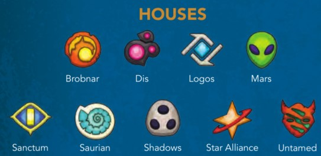

### VERSION 1.3 - MAY, 2019

* [Introduction](#intro)
* [Rules](#rules)
* [Glossary](#glossary)
* [Errata](#errata)
* [FAQ](#faq)
* [Link to the Rules-PDF](https://kop-cdn.keyforgegame.com/filer_public/30/03/30032847-fa82-46a3-a28b-984efc5a91ca/keyforge_rulebook_v8-compressed.pdf)
* [Look up deck rating](/awp.html)

# Introduction

## WELCOME TO THE CRUCIBLE…

_You are an Archon. Hailed by some as a god, respected by others for
your wisdom, you were born — or perhaps created — on the Crucible, a
world in which anything is possible._

The Crucible is ancient, but ever renewed. An artificial planet hanging in
the center of the universe, the Crucible’s many layers remain constantly
under construction by the enigmatic and mischievous Architects. For raw
materials, the Architects have harvested countless worlds, blending them
into a new whole both familiar and alien to the creatures that dwell there.

Whether lone specimens or entire cultures, the beings brought to the
Crucible find themselves in a strange wonderland with no obvious means
of returning to their former homes. Some thrive, building new societies
and developing new technologies with the aid of the mysterious psychic
substance known as Æmber. Some discard the trappings of their old
lives, adopting the ways and customs of new tribes discovered in this new
world. Others devolve, bodies and minds twisted beyond all recognition,
incorporating Æmber into their very bodies.

As an Archon, you have gathered followers in your journeys throughout
the Crucible, allies who find value in your ageless wisdom and your
ability to speak to all creatures. With the aid of these allies, you seek
out Vaults hidden throughout the Crucible by the cryptic Architects.
Each Vault can only be unlocked by Æmber-forged keys. Once open, a
Vault’s contents — the power and knowledge of the Architects — can be
consumed by only a single Archon.
When two Archons discover a Vault, only one can gain its knowledge.
Only one can move one step closer to the secret of the Crucible…

### OVERVIEW

KeyForge is a two-player card game in which each player takes the role
of an Archon, and leads that Archon’s deck against their opponent.

A player’s deck represents a team that is attempting to gain Æmber and
forge keys. The first player to gather three keys is able to unlock a Vault
and win the game.

The defining feature of KeyForge is that no two decks are alike. This is
not a trading card game — you cannot craft a deck. Rather, each deck
must remain as it is. Every deck in existence is unique!

## USING THIS DOCUMENT

If you have never played a game of KeyForge before, start by using the
Quickstart document included in the starter set to learn the basics of
the game.

After playing a game using the Quickstart, players can read the full rules
in this document and learn more about the KeyForge setting.

In addition to rules and setting information, this document includes a
Glossary of important game concepts and terminology that will be useful
while interpreting card abilities.

# RULES

## KEY CONCEPTS

This section introduces a number of foundational concepts to keep in
mind while playing the game.

### THE GOLDEN RULE

If the text of a card directly contradicts the text of the rules, the text of
the card takes precedence.

### OBJECTIVE

During the game, players use their cards to collect Æmber. Players use
Æmber to forge keys. The game ends immediately when a player forges
their third key, and that player wins the game.

### READY AND EXHAUSTED

Cards that are in play exist in one of two states.

**Ready** cards are oriented upright so that their text may be read from left
to right. A ready card can be used during a player’s turn, causing it to
exhaust.

**Exhausted** cards are rotated 90 degrees to the side. An exhausted card
is not able to be used until it is readied by a game step or card ability.

**All creatures and artifacts enter play exhausted.**

### RUNNING OUT OF TOKENS OR STATUS CARDS
There is no limit to the number of damage tokens, Æmber tokens, or
status cards that can be in the game area at a given time. If there is a
shortage of the provided tokens or status cards, other tokens, counters,
or coins may be used to track the game state.

## GAME SETUP

To set up the game, perform the following steps, in order:

1. Place all damage tokens, Æmber tokens, and status cards in a common supply within easy reach of both players.
2. Each player places their identity card to the left or right side of their play area.
3. Each player places three key tokens, one of each color, with the unforged side faceup near their identity card.
4. Randomly determine who is the first player. That player takes the first turn when the game begins. (If players are playing a series of games between two decks, in each game after the first, the player who used the deck that was defeated in the previous game chooses who is the first player.)
5. Each player shuffles their deck and offers it to the opponent for additional shuffling and/or a final cut.
6. The first player draws a **starting hand of seven cards**. The other player draws a **starting hand of six cards**.
7. Each player, starting with the first player, has one opportunity to **mulligan** their starting hand by shuffling it back into their deck and drawing a new starting hand with one fewer card in it. (This step is skipped in the Quickstart game.) 

The game is now ready to begin.

## TURN SEQUENCE

The game is played over a series of turns. Players alternate taking turns until one player wins the game.

Each turn consists of five steps:

1. Forge a key.
2. Choose a house.
3. Play, discard, and use cards of the chosen house.
4. Ready cards.
5. Draw cards.

The player taking a turn is referred to as the **active player**. The active
player is the only player that can perform actions or make decisions; a
player does not make any decisions when it is not their turn.

Each step is described in the following sections.

### STEP 1: FORGE A KEY

If the active player has enough Æmber to forge a key during this step,
they must do so. To forge a key, the active player spends Æmber from
the Æmber pool on their identity card, returning it to the common
supply. Then, that player flips any one of their key tokens over to its
forged side, indicating that the key has been forged.

* The default cost to forge a key is six Æmber. Some card abilities may increase or decrease this number.
* No more than one key can be forged during this step each turn, even if the active player has enough Æmber to forge multiple keys.
* Some cards have effects that allow Æmber on these cards to be spent when forging keys. If there is enough Æmber on cards with this effect you control combined with the Æmber in your Æmber pool to forge a key you must do so during Step 1.

### STEP 2: CHOOSE A HOUSE

Each _KeyForge_ deck is composed of three different houses, which are
shown on the identity card. During this step, the active player chooses
one of the houses on their identity card to activate, making it the **active house** for
the remainder of the turn. This active house determines which cards the
active player can play, discard from their hand, and use this turn.

* After choosing a house, the active player has the option to take all cards in their archives and add them to their hand. (See “Archives” in the Glossary.)
* If a player controls a card that does not belong to one of the on their identity card, they may (if they desire) choose and activate that house during this step instead of one of the three houses in their deck.
* A player cannot choose to activate a house unless it is either on their identity card or they control a card that belongs to that house. If a card effect instructs a player that they must activate a house other than one in the aforementioned categories, that card effect is ignored (See Cannot VS Must/May.)

### STEP 3: PLAY, DISCARD, AND USE CARDS OF THE CHOSEN HOUSE
The active player may play or discard any number of cards of the active
house from their hand and may use any number of cards of the active
house that are in play under their control. Eligible cards may be played,
used, or discarded in any order.

A card’s house is determined by an icon in the
upper-left corner. If the active house corresponds
to a card’s icon, that card is eligible to be played,
used, or discarded.

Rules for playing, discarding, and using cards are described later.

* **First Turn Rule:** During the first player’s first turn of the game, that player cannot play or discard more than one card from their hand. Card effects can modify this rule.
* The active player may not play, use, or discard cards that aren't of the active house unless specified by a card ability

### STEP 4: READY CARDS

The active player readies each of their exhausted cards.

### STEP 5: DRAW CARDS

The active player draws cards from the top of their deck until they have
six cards in their hand. After a player completes this step, their turn ends.

* If the active player has more than six cards in hand, they do not discard down to six.
* If a player needs to draw cards (during this step or at any other time) and cannot because their deck is empty, that player shuffles their discard pile to reset their deck, and then continues to draw.
* When a player’s turn ends, if that player has enough Æmber in their pool to afford a key, the player announces “Check!” so that their opponent knows the forging of a key at the start of that player’s next turn is imminent.

## PLAYING CARDS

The active player is permitted to play any number of cards that belong to
the active house during step three of their turn.

#### ÆMBER BONUS
Many cards in the game have an Æmber bonus below the house icon.
When a card with an Æmber bonus is played, the first thing the active
player does is gain that much Æmber. Each time a player gains Æmber
(for any reason), the Æmber is placed in that player’s Æmber pool (on
their identity card).

#### PLAY ABILITIES

Some cards have a bold **“Play:”** ability. Such abilities resolve after the
card’s Æmber bonus is collected, if it has any, and immediately after the
card enters play.

### CARD TYPES

There are four types of cards in the game: action cards, artifacts,
creatures, and upgrades. There are different rules describing how each
card type is played.

#### ACTION CARDS

When an action card is played, the active
player resolves the card’s **“Play:”** ability
and, after resolving as much of the ability
as possible, places the card in their
discard pile.

### ARTIFACTS

Artifacts enter play exhausted and are
placed in a row in front of the player but
behind that player’s battleline, which is
explained on the next page. Artifacts
remain in play from turn to turn.

#### CREATURES

Creatures enter play exhausted and are placed in the front row of
the active player’s play area. This row is referred to as the battleline.
Creatures remain in play from turn to turn, and they each have
power and armor values that they use to resolve fights, which are
described later.

Each time a creature enters play, it must be placed on a flank — at the
far left or the far right of its controller’s battleline. Each time a creature
leaves play, shift the battleline inward to close the gap.

#### UPGRADES

Upgrades enter play attached to (i.e., partially overlapped by) a creature
chosen by the player who controls the upgrade. Each upgrade remains in
play from turn to turn and modifies the card to which it is attached.

* If the card to which an upgrade is attached leaves play, the upgrade is discarded.
* If an upgrade cannot attach to a card in play, the upgrade cannot enter play.

### DISCARDING CARDS

The active player can discard from their hand any number of cards from
the active house during step three of their turn. Cards are discarded one
at a time, at any point throughout this step. This lets players remove
cards that they do not want to play from their hand, freeing up space to
draw more cards at the end of the turn.

### USING CARDS

The active player can use any number of cards from the active house that
they have in play during step three of their turn. Depending on a card’s
type, the active player is able to do different things when using that card.

#### UPGRADES

An upgrade modifies the creature it is attached to and is not used
independently of that creature.

#### USING ARTIFACTS

There are two types of abilities that enable a player to use an artifact:
**“Action:”** abilities and **“Omni:”** abilities.

* When a player uses an artifact, they exhaust the card and then resolve its abilities.
* A player can only use an **“Action:”** ability if it is on a card that belongs to the active house.
* A player can resolve an **“Omni:”** ability even if it is on a card that does **not** belong to the active house.
* Some artifacts require that they be sacrificed as part of the cost of using them. When an artifact is sacrificed, it is placed in its owner’s discard pile. A player must still exhaust such an artifact when using it.
* Artifacts cannot be used to reap or to fight.

#### USING CREATURES

When a player uses a creature, that player must exhaust the creature,
and the player has the option to reap, fight, or to trigger the creature’s
**“Action:”** ability, or trigger the creature's **“Omni:”** ability. Any card effect that causes a creature to fight, reap, trigger its **“Action:”** ability, or to trigger its **“Omni:”** ability is causing that creature to be used.

##### REAP

**Any ready creature of the active house may reap.** When a
creature is used to reap, the creature exhausts and its controller gains 1 Æmber for their Æmber
pool. Then, all **“Reap:”** abilities the creature has, if it has any, resolve.

##### FIGHT

**Any ready creature of the active house may fight.** When a creature
is used to fight, the creature exhausts and its controller chooses one eligible creature controlled
by the opponent as the target of the attack. Each of the two creatures
deals an amount of damage equal to its power (the value to the left
of the card’s title) to the other creature. All of this damage is dealt
simultaneously. After the fight resolves, if the creature that is being
used to fight survives, all **“Fight:”** abilities the creature has, if it has
any, resolve.

A creature cannot fight if there is no enemy creature that can be
chosen as the target of the attack.

##### ACTION

**Any ready creature of the active house may trigger its “Action:” ability, if it has one.**
When a creature is used to trigger its **“Action:”**
ability, the creature exhausts and all **“Action:”** abilities the creature
has resolve.

##### OMNI

**Any ready creature may trigger its “Omni:” ability, if it has one,** even if it does **not** belong to the active house. When a creature is used to trigger its **“Omni:”** ability, the creature exhausts and all **“Omni:”** abilities the creature has resolve.

#### DAMAGE AND ARMOR

When a creature is dealt damage, place an amount of damage tokens
equal to the amount of damage dealt on the creature. If a creature has as
much or more damage on it as it has power, the creature is destroyed and
placed on top of its owner’s discard pile. If a creature has an armor value
(to the right of the card’s title), the armor prevents that much incoming
damage each turn. (For more details, see “Armor” in the Glossary.)

* When a creature leaves play, any Æmber on that creature is gained by the opponent. (See “Capture” in the Glossary.)

#### COMBAT EXAMPLE

### CARD ABILITIES

Unless otherwise specified by the ability, the active player makes all decisions while resolving an ability.

For details on specific terminology that can be found in card ability text, see the Glossary.

#### RESOLVE AS MUCH AS YOU CAN

While resolving a card ability, resolve as much of the ability as can be resolved, and ignore any parts of the ability that cannot be resolved.

**Example**: _Aaron plays the card Anger (COTA 001), that reads "**Play**: Ready and fight with a friendly creature.", and chooses his friendly Snufflegator (COTA 358) to resolve the ability on. However, the Snufflegator is already ready, so Aaron ignores that part of the ability and just uses his friendly Snufflegator to fight._

#### USING CARDS VIA OTHER CARD ABILITIES

If a card ability allows a player to play or use another card (or to fight or
to reap with a card), the chosen card may belong to any house unless the
ability specifically states otherwise.

* When using a card via a card ability, any other requirements of using the card (such as exhausting to reap, fight, or resolve its **“Action:”** ability) must be observed, or the card cannot be used.
* Players can only use cards they control, unless a card ability specifically states otherwise.

#### THE RULE OF SIX

Occasionally, a situation may emerge in which, through a combination
of abilities, the same card may be played or used repeatedly during the
same turn. A player cannot play and/or use the same card and/or other
copies of that card (by title) more than **six times** during a given turn.

#### CONSTANT ABILITIES

If a card has an ability that does not have a boldfaced precursor, the
ability is a constant ability that is active so long as the card remains in
play and meets all conditions specified by the ability.

* Constant abilities on a card are active even while that card is exhausted.
* Applying the effects of a constant ability is not considered using a card and therefore does not cause the card to exhaust.

### CHAINS

Chains represent supernatural bindings that are occasionally placed
onto specific Archons by the Architects: sometimes in an effort to better
challenge the Archon to grow and overcome greater adversity, and
other times to penalize the Archon for breaking a rule or a piece of
Crucible etiquette.

A player may gain chains through card abilities during a game. When
a player gains chains, that player increases their chain tracker by the
number of chains gained.

Each time (including during setup) a player with one or more chains would
draw one or more cards to refill their hand, that player draws fewer cards
(based on their current chain level, see below) and then sheds one chain
by reducing their chain tracker by one.

The more chains a player has, the greater the card penalty becomes.

* Chains 1–6: draw 1 fewer card.
* Chains 7–12: draw 2 fewer cards.
* Chains 13–18: draw 3 fewer cards.
* Chains 19–24: draw 4 fewer cards.

**Example:** Tori has been assigned seven chains. During setup, Tori will
draw two fewer cards and shed a chain. Then, the next six times Tori
refills her hand, she will draw up to five cards and shed another chain.
After all of her chains have been shed, Tori will draw to the standard
hand size.

#### CHAIN HANDICAPS (OPTIONAL)

When playing a game between a weaker deck and a stronger
deck, players may use chains as a means to handicap the stronger
deck. Chains are used when players want a fair game between two
known decks rather than a potentially unfair competition between decks
that aren’t known. When playing with new decks, or competing in a
tournament, players will not use this handicap.

##### SUGGESTIONS FOR ASSIGNING CHAINS

When the players have a sense that a particular deck is stronger than
the opposing deck, start it with four chains. From then on, every time
the chained deck wins three games in a row against that opposing
deck, adjust the number of chains up by one, and if it loses three
games in a row, adjust the number of chains down by one.

As a player plays more games with their collection, the number of
chains assigned to a deck will fluctuate up and down based on the
matchup and how well the deck has performed against the opposing
deck.

##### CHAIN BIDDING

If players are reasonably familiar with two decks they can ignore the
suggested number of chains, and instead bid a number of chains for
the right to use a particular deck.

**Example:** Terry and Julie decide to play Mother Mahospot against
Chancellor Fisher. Mother Mahospot is a deck that both players are
very familiar with, feel is quite strong, and enjoy playing. Chancellor
Fisher is a newer deck, that the players are not as comfortable
playing. The above guidelines suggest they begin with four chains
on Mother Mahospot. Julie looks at Fisher, considers a moment, and
says, “I’ll play Mother Mahospot at five.” Terry raises to six. Julie
goes to seven. Terry decides to let her play it at seven, and plays
Chancellor Fisher.

### WHAT’S NEXT

You are now familiar with the basic rules of the game. The next section
of this book contains a Glossary of advanced concepts that can be
referenced while playing or interpreting card abilities.

# GLOSSARY

This Glossary includes a number of concepts and terms players may
encounter while playing the game, in alphabetical order. Instead of
reading this section from beginning to end, players are encouraged to
only look up new concepts as they are encountered during play.

### ABILITY, CARD ABILITY

An ability is the special game text a card contributes to the game.

Unless an ability explicitly references an out-of-play area (such as a hand,
deck, archives, or discard pile), that ability can only interact with cards
that are in play.

### ACTION ABILITY

To use an **“Action:”** ability during their turn, the active player must
exhaust the card. The ability then resolves.

### ACTIVE HOUSE

The active house is the house that the active player has chosen for the
current turn.

### ACTIVE PLAYER

The active player is the player taking the current turn. The active player
makes all necessary decisions for all card abilities or timing conflicts that
need to resolve during their turn.

### ADJACENT

When a creature card refers to a game element as being “adjacent” to
that creature or being played “adjacent” to that creature, it is referring to
a card being in or being played into the position to the immediate right
or immediate left of that creature.
See also “Neighboring”

### ALPHA

When a card has the Alpha keyword, it can only be played if you haven’t
played, used, or discarded any other cards during step 3 of your turn. 

### ÆMBER

Æmber is tracked by Æmber tokens, and is used to
forge keys.

Only Æmber in your own Æmber pool is considered “yours” for the purpose of card effects.

See also: Capture, Keys, Reap, Steal.

### ARCHIVES

A player’s archives is a facedown game area in front of that player’s
identity card. Card abilities are the only means by which a player is
permitted to add cards to their archives. During step 2 of a player’s turn,
after they select an active house, the active player is permitted to pick up
all cards in their archives and add those cards to their hand.

Cards in a player’s archives are considered out of play.

A player may look at their archives at any time. A player is not permitted
to look at an opponent’s archives.

If the ability instructing a player to archive a card does not specify where
the card is archived from, the archived card comes from that player’s hand.

### ARMOR

Some creatures have an armor value to the right of the card title. Armor
prevents an amount of damage equal to the armor value that the creature
would take each turn. Armor prevents damage before it is actually dealt.
For example, if a creature has two armor and is dealt
one damage, that damage is instead prevented by the armor, leaving the creature
with one armor that can prevent damage left for the rest of the turn. If the
creature is later dealt three more damage during that turn, one damage is
prevented and the other two damage are dealt to that creature.

If a creature gains armor, the gains are additive and accumulate on top of
the creature’s printed armor value.

If a creature gains armor during a turn, the gained armor does not
prevent damage already dealt that turn. If a creature loses armor during
a turn, it is not retroactively dealt damage that was already prevented by
the armor.

If a creature loses any amount of armor, it loses armor that has been
used to prevent damage this turn before it loses armor that has not been used to prevent damage this turn.

If a creature has a “~” symbol in its armor field, the creature has no
armor. Such creatures may gain armor through card effects.

### ASSAULT (X)

When a creature with the assault (X) keyword attacks, it deals damage
equal to its assault value (i.e., “X”) to the creature it is fighting before the
fight resolves. (The active player chooses whether this occurs before or
after other “Before Fight” effects and keywords.) If this damage destroys
the other creature, the rest of the fight does not occur.

If a creature with the assault (X) keyword gains another instance of the
assault (X) keyword, the two X values are added together.

### ATTACK, ATTACKER, ATTACKING

See “Fight” on page 10.

### BATTLELINE

The battleline is the ordered line of creatures a player controls in play.
See “Creatures” on page 6.

### BEFORE

If the word “before” is used in an ability (for example, **“Before Reap:”** or
**“Before Fight:”**), that ability resolves before resolving the game effect of
the reap or fight (but after the card exhausts, if exhausting is required to
use the card).

### CANNOT VS MUST/MAY, CANNOT VS PERMISSIVE

If two card efects are simultaneously instructing a player that they
“cannot” do something and that they “must” or “may” do the same
thing, the “cannot” effect takes precedence.

**Example**: _Anna controls a Pitlord (COTA 093) which reads “While
Pitlord is in play you must choose Dis as your active house.” On their 
next turn Anna’s opponent plays Restringuntus (COTA 094) which reads
"**Play**: Choose a house. Your opponent cannot choose that house as
their active house until Restringuntus leaves play.” and chooses Dis
for its ability. On Anna’s next turn, she both must and cannot choose
Dis, but because cannot takes precedence over must, she only cannot
choose Dis and must choose one of her other houses instead._

If two card effects are simultaneously instructing a player that they
cannot do something and that they may do something, the “cannot”
effect takes precedence.

### CAPTURE

Captured Æmber is taken from an opponent’s Æmber pool and placed
on a creature controlled by the capturing player. Players may not spend
captured Æmber.

When a creature with Æmber on it leaves play, the Æmber is placed in
the opponent’s Æmber pool.

Unless otherwise specified, Æmber is placed on the creature that
captured it.

### CHAIN, CHAINS

Some card abilities cause a player to gain one or more chains. If a player
gains chains, that player increases their chain tracker by the number of
chains gained.

If a player has at least one chain when refilling their hand _and would draw cards based on the number of remaining cards in their hand_, they
draw fewer cards according to the chart below. Then, they shed one
chain by reducing the number on their chain tracker by one.

* Chains 1-6: draw one fewer card.
* Chains 7-12: draw two fewer cards.
* Chains 13-18: draw three fewer cards.
* Chains 19-24: draw four fewer cards.

While drawing an initial hand of cards during setup, if a deck has chains
assigned to it, the chains also apply to the initial hand of cards drawn as
if you were refilling a hand during step 5. A chain is shed for this initial
draw as per the standard rules.

See ”Chains” on page 8.

### CONTROL

A player owns the cards that begin the game in their deck. When a card
is played, it enters play under the control of the active player.

A player can take control of an opponent’s card. When this happens,
that card is placed in the new controller’s play area. If it is a creature, it is
placed on a flank of the new controller’s battleline. If multiple effects that
take control of a card are used on the same card, the most recent effect
takes precedence.

If a player takes control of a card that belongs to a house not in the new
controller’s deck, they can make that house the active house during step
2 of their turn.

If a card that has changed control leaves play for any reason, it moves to
its owner’s appropriate out-of-play zone.

### COST, AT CURRENT COST

The base cost to forge a key is six Æmber. This cost may be modified by
card abilities. The modified cost is referred to as the current cost.

### DAMAGE

Damage a creature has taken is tracked by placing damage tokens on
the creature. If a creature has an amount of damage on it equal to or
greater than its power, the creature is destroyed. Damage on a creature
does not reduce its power. If multiple creatures are damaged by a single
effect, that damage is dealt simultaneously.

For more details on damage and combat, see page 7.

### DEPLOY

A creature with the deploy keyword does not need to be played on
the flank of its controller’s battleline. Instead, when it is played it can
be placed anywhere in its controller’s battleline, including between two
other creatures.

### DESTROYED

When a card is destroyed, it is placed in its owner’s discard pile. If
multiple cards are destroyed simultaneously they are put into the discard
pile(s) simultaneously and any non-”**Destroyed**:” abilities cannot trigger.
(The active player determins what order the destroyed cards are put into the discard pile(s).)

If a card has a **“Destroyed:”** ability, the effect automatically resolves
immediately before the card would be destroyed, which is also before it
leaves play.

### DISCARD PILE

When a card is destroyed or discarded, it is placed on top of its owner’s
discard pile. The cards in each player’s discard pile are open information,
and may be referenced at any time.

The order of cards in a player’s discard pile is maintained during play,
unless a card ability causes this order to change.

When a player runs out of cards in their deck and are required to draw,
they shuffle their discard pile to create a new deck.

### ELUSIVE

The first time a creature with the elusive keyword is attacked each turn, it
is dealt no damage and deals no damage to the attacker in the fight.

Elusive only stops damage that would be dealt by each creature’s power;
damage dealt by keywords or other abilities still applies.

### END OF TURN

End of turn effects are resolved when a player’s turn is over—after step 5,
the “Draw Cards” step.

### ENEMY

If a card ability refers to an “enemy” game element, it refers to an
element currently controlled by the opponent.

### FIGHT

When a player uses a creature to fight, the player exhausts the creature
and chooses an opponent’s creature. Both creatures deal an amount of
damage equal to their power value to the opposing creature in the fight,
and both are “fighting” for the purposes of card effects.

A creature used to fight is said to be “attacking” and can be referred to
as “the attacker” during that fight.

If the attacker is not destroyed, all **“Fight:”** abilities on the attacking
creature then resolve. If either creature in a fight has a constant ability
referencing the end of the fight (example: “after an enemy creature is
destroyed fighting this creature…”), the creature must survive the fight to
resolve the ability. Only the attacker can trigger **“Fight:”** abilities.

### “FIGHT WITH”

If an ability instructs a player to “fight with” or “ready and fight with”
a creature, the ability is granting the player permission to use the
designated creature to fight. The fight is resolved following the standard
rules for fighting, against a creature controlled by the opponent.

### FLANK

The creatures on the far right and far left of a player’s battleline are on
the flanks of the line. A creature in this position is referred to as a flank
creature. Any time a creature enters play or changes control, the active
player chooses which flank of its controller’s battleine it is placed on.

If a battleline only has one creature in it, that creature is on both the left and right flank and is considered a _flank_ creature.

### FORGE

For details on forging keys, see page 4.

### FRIENDLY

If a card ability refers to a “friendly” game element, it refers to an
element currently under the control of the same player.

### HAZARDOUS (X)

When a creature with the hazardous X keyword is attacked, it deals X
damage to the attacking creature before the fight resolves. (The active
player chooses whether this occurs before or after other “Before Fight”
effects and keywords.) If this damage destroys the other creature, the 
rest of the fight does not occur.

If a creature with the hazardous (X) keyword gains another instance of the
hazardous (X) keyword, the two X values are added together.

### HEAL

If an ability “heals” a creature, remove the specified amount of damage
from the creature.

If an ability “fully heals” a creature, remove all damage from the creature.

Any creature can be chosen to be healed by a card effect that heals,
even if it does not have any damage on it. However, if no damage is
removed from the creature, it is not considered to have been “healed”
for the purpose of card effects that reference healing.

### HOUSE CHOICE

Each turn, a player must choose one of the three houses indicated by
their identity card, if able. Some card abilities may restrict a player’s
house choice.

If a player has gained control of a card that does not belong to one of
their three houses, that card’s house becomes an eligible choice for that
player while the player retains control of the card.

If there is no legal choice of house, the player plays the turn with no
active house.

If a player is faced with two (or more) “must choose” mandates, the
player may choose either of those options.

### “IF YOU DO” AND “IN ORDER TO”

If an ability includes the phrase “if you do” or “in order to,” the player
referenced by the ability must successfully and completely resolve the
text that precedes that phrase before they can resolve or perform the
text that follows that phrase. In other words, if the first part of the ability
is not successfully and completely resolved, that which follows the phrase
does not resolve or cannot be performed.

### KEYS

The first player to forge all three of their keys immediately wins
the game.

The color of a key has no impact on the game. Future card abilities may
reference keys of a specific color.

For details on forging keys, see page 4.

### LEGACY

This symbol indicates that a card is a legacy card. A legacy
card is a rare instance of a card that has been brought
forward from a previous set of KeyForge. It is legally part of
the deck it is in for all game purposes, including tournament
play.

### LEAST POWERFUL

A reference to the “least powerful” creature refers to the creature in play
with the lowest power. If there are multiple creatures that qualify, each is
considered “least powerful.”

If an ability requires the selection of a single least powerful creature, and
multiple creatures are tied, the active player chooses one.

#### Groups of “Least Powerful”

If a card effect refers to a group of “the X least powerful” creatures, it is
referring to a number of creatures in play that have an equal or lower power
than every creature that does not belong to that group. If there are not enough
creatures with the lowest power to fulfill the group, then a creature with the
next lowest power is eligible to be considered a part of the group. This
continues until the group has been filled or there are no creatures remaining.
If at any point multiple creatures are tied at the same power that could
qualify them for the group, but there is not enough space in the group for each
tied creature, the active player chooses which of the tied creatures are part
of the group

### LEAVES PLAY

If a card that is in play leaves play (is returned to hand or deck,
destroyed, discarded, archived, or purged), all non-Æmber tokens and
status cards on the card are removed, all upgrades on the card are
discarded, and all lasting effects applied to the card expire.

When a card moves from an in–play zone to an out-of-play zone in which the
identities of cards are hidden from the opponent (such as a player’s hand,
deck, or archives), any pending effects that are currently or about to interact
with that card no longer do so, unless a card effect explicitly states that it
interacts with that zone.

If a creature with Æmber on it leaves play, the Æmber is placed in the
opponent’s Æmber pool. If a non-creature card with Æmber on it leaves
play, the Æmber is returned to the general token pool.

When a card leaves play it is always put into its owner’s appropriate
out-of-play zone, unless a card effect explicitly states that it interacts with
that zone.

If a card has a “Leaves Play:” ability, the effect happens automatically
immediately before the card leaves play.

### MAVERICK

This symbol indicates that a card is a maverick. A maverick
is an extremely rare instance of a card that has left its
standard house and is now a part of a new house. For all
game purposes, treat a maverick as belonging to the house
printed on its graphic template.

### MAY

If an ability includes the word “may,” the text that follows “may” is
optional. If a player chooses to resolve a “may” ability, the player must
resolve as much of the ability as they are able.

### MOST POWERFUL

A reference to the “most powerful” creature refers to the creature in play
with the highest power. If there are multiple creatures that qualify, each is
considered “most powerful.”

If an ability requires the selection of a single most powerful creature,
and multiple creatures are tied, the active player chooses among the
tied creatures.

#### Groups of “Most Powerful”

If a card effect refers to a group of “the X most powerful” creatures, it is
referring to a number of creatures in play that have an equal or higher power
than every creature that does not belong to that group. If there are not enough
creatures with the highest power to fulfill the group, then a creature with the
next highest power is eligible to be considered a part of the group. This
continues until the group has been filled or there are no creatures remaining.
If at any point multiple creatures are tied at the same power that could
qualify them for the group, but there is not enough space in the group for each
tied creature, the active player chooses which of the tied creatures are part
of the group.

**Example**: Tom plays the action card “Three Fates (COTA 071) which reads, “**Play**:
Destroy the 3 most powerful creatures.” In play there is an 8 power creature, a
7 power creature, and two 5 power creatures. Tom must select 3 creatures to
fill the group and must choose the 8 power creature as the first creature for
the group. There are no other creatures in play that are tied for most
powerful. In order to fill the group the next most powerful creature is
selected, the 7 power creature. After this creature is selected, again there is
no creature in play that is tied at 7 power, so a creature from the next
highest power must be selected. Tom thus must choose one of the 5 power
creatures to complete the group.

### MULLIGAN

During setup, each player, starting with the first player, has one
opportunity to mulligan their starting hand. This is done by shuffling the
starting hand back into the deck and drawing a new starting hand with
one fewer card in it.

After a player chooses to mulligan, that player must keep the new
starting hand.

If a player is using a deck that has chains applied to it at the start of the
game and takes a mulligan, they do not shed a chain from the mulligan, but do
draw one fewer card than they had before the mulligan as per the normal
mulligan rules.

### NEIGHBOR

The creatures to the immediate left and right of a creature in a player’s
battleline are its neighbors.

### OMEGA

After a card with the Omega keyword is played, the current step of the
game ends. You cannot play, use, or discard any more cards and play
continues to the next step.

### OMNI

The active player may trigger any **”Omni:“** abilities under their control
during any of their turns, even if the card with the **”Omni:“** ability does
not belong to the active house. When a player uses a creature to trigger its
“**Omni:**” ability, the player exhausts the creature and then resolves the
**“Omni:”** ability.

### OFF HOUSE

An off house card is any card that belongs to a house that is not the
active house.

### OPPOSING

When a creature is involved in a fight (either because it was used to fight,
or because it was attacked by another creature), the other creature in the
fight is the opposing creature.

### OTHER COUNTERS

Some cards may refer to counters that do not have official components
to represent them. Players can use any available resources to represent
these counters such as coins, slips of paper, or even poker chips. These
counters have no inherent rules, instead the card that creates them
provides context to how the counters function.

**LIST OF COUNTER TYPES:**

* Doom Counters

### PAY

If a player must pay Æmber to an opponent, the Æmber is removed from
the paying player’s pool and added to the opponent’s pool.

### PLAY

When a card has a **“Play:”** ability, the effect occurs any time the card
is played. For creatures, artifacts, and upgrades, the ability resolves
immediately after the card enters play. For action cards, the ability
resolves, and then the card is immediately placed in its owner’s discard pile.

If an ability “plays” a card from a source other than hand, **“Play:”**
abilities on the card resolve. If an ability “puts” a card “into play,”
**“Play:”** abilities on the card do not resolve.

### POISON

Any damage dealt via the power of a creature with the poison keyword
during a fight destroys the damaged creature. This occurs when the
damage is successfully applied to the opposing creature.

Poison has no effect if all of the damage is prevented by armor or
prevented by another ability—poison only resolves when one or more
damage is successfully dealt.

Poison refers only to damage that would be dealt by the creature’s
power, not by damage that is dealt by keywords or other card abilities.

### POWER COUNTER +1, POWER STATUS CARD

When a creature is given a “+1 power counter,” one such status card is
placed on the creature. For each of these cards that is on a creature, that
creature’s power is increased by one.

### PRECEDING, REPEAT THE PRECEDING

If card text instructs players to repeat a preceding effect, the entirety
of the effect before the text providing the instruction to repeat resolves
again.

**Note:** Repeating an effect does not interact with the Rule of Six (see
page 7), as the Rule of Six only applies to playing or using cards, not
triggering their effect multiple times.

### PURGE

When a card is purged, it is removed from the game and placed
facedown beneath its owner’s identity card. Purged cards no longer
interact with the game state in any manner.

### RARITY

A card’s rarity symbol can be found at the bottom of the card, near the
collector number. A card’s rarity (common, uncommon, rare, or special)
is used by the deck-generation algorithm to determine how frequently
it will appear in decks. Special cards have a different type of distribution
and do not obey the game’s standard rarity rules.

### REAP

When a player uses a creature to reap, the player exhausts the creature,
gains 1 Æmber for their Æmber pool, and then all **“Reap:”** abilities on
the creature resolve.

### REPEAT

If card text instructs players to repeat an effect, the entirety of the effect
resolves again including the text to repeat the effect. If the card that
is creating a repeating effect is removed from play, the effect can no
longer repeat.

**Note:** Repeating an effect does not interact with the Rule of Six (see
page 7,) as the Rule of Six only applies to playing or using cards, not
triggering their effect multiple times.
See also “Preceding.”

### RETURN

When captured Æmber is returned, it is placed in the opponent’s Æmber
pool.

### SACRIFICE

When a player is instructed to sacrifice a card, that player must discard
that card from play.

When a card is sacrificed, that card is considered to have been
destroyed, and any **“Destroyed:”** abilities the card has resolve.

A player cannot sacrifice a card they do not control.

### SEARCH

When a player searches a game area (such as a deck), that player looks
at all the cards in the specified area without showing those cards to the
opponent. A player may choose to fail to find the object of a search.

If an entire deck is searched, the deck must be adequately shuffled upon
completion of the search.

If a discard pile is searched, the cards are kept in the same order.

### SELF-REFERENTIAL TEXT

If a card’s ability refers to its own title, that reference is only to itself and
not to other copies of the card.

### SKIRMISH

When a creature with the skirmish keyword is used to fight, it takes no
damage from the opposing creature when the damage from the fight
is dealt.

This applies only to damage that would be dealt by the opposing
creature’s power, not by damage that is dealt by keywords or other
card abilities.

### SPLASH

When an ability deals damage to a creature “with splash damage,” the
splash damage is dealt to each of the target creature’s neighbors.

### STEAL

When an ability steals Æmber, the stolen Æmber is removed from the
opponent’s Æmber pool and added to the Æmber pool of the player
resolving the steal ability.

If an ability steals more Æmber than a player has remaining in their pool,
the ability steals only the amount remaining in the pool.

### STUN, STUN STATUS CARD

When a creature becomes stunned, place a stun status card on it. The next time that creature is used, the only effect of it being used is the creature exhausts and the stun status card is removed instead of anything else happening. The creature does not reap or fight, and any “**Reap**:,” “**Fight**:,” or **“Action:”** abilities on the creature do not resolve.

If a card effect causes a creature to be used while it is stunned, the creature
is exhausted and the stun status card is removed, just as if the creature had
been used normally.

Constant abilities and abilities that do not require the creature to reap,
fight, or be used are still active.

If a stunned creature is attacked, it still deals damage to the attacking
creature during the fight.

While a creature is stunned, it cannot have another stun status card placed on
it. If an effect attempts to stun a stunned creature that effect does not stun
the already stunned creature.

### SWAP

If two game elements are swapped, they exchange places with
one another.

When two creatures are swapped, they exchange positions. This means
that each takes the position in the battleline of the other. The two
creatures swapped must always be controlled by the same player.

If cards from two distinct game areas are swapped (such as a card in play
and a card in hand), the cards switch game areas.

### TAUNT

If a creature has the taunt keyword, any of its neighbors that do not
have the taunt keyword cannot be attacked by an enemy creature that is
being used to fight.

In the battleline, taunt creatures are slid slightly forward to indicate their 
presence to the opponent.

### “THIS WAY”
If an ability refers to an effect that occurred “this way,” it is referring to
an effect that was produced by the same resolution of that same ability.

### TURN

A turn consists of one player performing the five steps detailed in the
game’s turn sequence, which are:

1. Forge a key.
2. Choose a house.
3. Play, discard, and use cards of the chosen house.
4. Ready cards.
5. Draw cards.

### TRAITS

Traits are descriptive attributes (such as “Knight” or “Specter”) that may
be referenced by other cards. Traits are listed at the top center of a card’s
text box.

Traits have no inherent game effect, but may be referenced by
card abilities.

### UNFORGE

If a previously forged key is “unforged,” flip the key token to its unforged
side. The key no longer counts toward its controller’s victory condition
and must be forged again to win the game.

### USE

See “Using Cards” on page 6.

# ERRATA

This section conatins the official errata that have been made to individual
cards in _KeyForge_. Errata overides the printed information on the card it
applies to.

## Library Access (COTA 115)
Should read: “Play: For the remainder of the turn, each time you play
another card, draw a card. Purge Library Access.”

## Biomatrix Backup (COTA 208)
Should read: “This creature gains, ”**Destroyed**: Put this creature into its owner’s archives.””

## Bait and Switch (COTA 267)
Should read: “Play: If your opponent has more {A} than you, steal 1{A}.
Repeat the preceding effect if your opponent still has more {A} than you.”

## Drummernaut (AOA 006)
Should read: “Play/Fight/Reap: Return another friendly Giant creature to
your hand.”

# FREQUENTLY ASKED QUESTIONS

This section provides answers to a number of common questions that
are asked about the game. These questions are presented in a “Question and Answer” format, with the newest questions at the end.

#### My opponent has 14 Æmber in their pool and I have 0 in mine. At the start of my turn I select Shadows as the active house and play the card Bait and Switch (CoTA 267). How many times does Bait and Switch trigger?
In this situation, Bait and Switch’s effect will be triggered 2 times. When
the effect is triggered for the first time time it checks if your opponent
has more Æmber than you, and if they do it will repeat the first effect
again, stealing another Æmber. However, since the card says to repeat
the preceding effect and not the whole effect it can only ever trigger
twice. 

#### My opponent has 14 Æmber in their pool and I have 0 in mine. At the start of my turn I select Shadows as the active house and play the card Bait and Switch (CoTA 267). How many times does Bait and Switch trigger?

In this situation, Bait and Switch’s effect will be triggered 7 times. Each
time the effect is triggered it will check if your opponent still has more
Æmber than you, and if they do it will trigger again. So after the first
time the effect triggers you will have 1 Æmber and your opponent will
have 13, the second time you will have 2 Æmber and your opponent
will have 12, then 3 and 11, 4 and 10, 5 and 9, 6 and 8, then finally 7 and 7. Once both players have the same amount of Æmber when the effect
checks if your opponent has more Æmber than you the effect will see
that your opponent does not and the card effect will not trigger again.

**Note:** Repeating an effect does not interact with the Rule of Six (see
page 7), as the Rule of Six only applies to playing or using cards, not
triggering their effect multiple times.

#### Its the first turn of the game and I am going first. I choose house Logos to be the active house and play the card Phase Shift (CoTA 117). Does this allow me to play another card this turn even though the First Turn Rule (see page 5) is in effect?

Playing Phase Shift will allow you to play another card from your hand this turn, since the First Turn Rule can be modified by card effects.

#### Its the first turn of the game and I am going first. I choose house Logos to be the active house and play the card Wild Wormhole (CoTA 125). Can Wild Wormhole’s effect be resolved even though the First Turn Rule (see page 5) is in effect?

Wild Wormhole’s effect can be resolved. The First Turn Rule specifies
that players cannot play or discard more than one card from their hand.
However it does not prohibit cards from being played or discarded
from other game areas, such as your deck.

#### I have 2 chains and 7 cards in hand when moving to my draw cards step. Will I shed a chain during this step?

No, you will not shed a chain during this draw cards step. Chains are
only shed when a player would draw cards during the draw step and
the chains prevent them from doing so (see “Chains” on Page 8). Since
you already have 7 cards in your hand, you aren’t going to be drawing
any cards, and thus don’t lose any of your chains.

#### I have 2 chains and 5 cards in hand when moving to my draw cards step. Will I shed a chain during this step?

Yes, you will shed a chain during this step. Chains are only shed when a
player would draw cards during the draw step and the chains prevent
them from doing so (see “Chains” on Page 8). You only have 5 cards in
hand, and normally you would draw a card to refill your hand. However
because of the chains you are prevented from drawing that card. Since
you would normally have drawn the card and the chain prevented it,
you then shed 1 chain.

#### I have a creature that has the card Biomatrix Backup (CoTA 208) attached. Its my opponent’s turn and they use one of their creatures to attack and destroy my creature. What happens?

Since it is your opponent’s turn and they are the active player, they will
get to make all decisions for all cards. In this case Biomatx Backup has
the word “may”, meaning that the effect is optional. Thus if your creature
is destroyed with the upgrade on it during your opponent’s turn, your
opponent will decide whether the card is put into your archives or not.

#### I have the card Pitlord (CoTA 093) in play and my opponent plays the card Restringuntus (CoTA 094) and chooses house Dis. What happens when I go to declare my house on my next turn?

On your next turn during the choose a house step of your turn you
will be in a position where you must choose house Dis because of the
Pitlord, but also cannot choose house Dis because of the Restringuntus.
In this case no house is a legal option to be your active house and you
must declare no house as your active house (see “House Choice” on
Page 10.)

#### I have chosen house Logos to be my active house this turn and start off by playing Library Access (CoTA 115), I then play Wild Wormhole (CoTA 125). In what order do I resolve this combination of effects?

When you play a Wild Wormhole after playing a Library Access the
following happens in this order:

1. You gain 1 Æmber from Wild Wormhole’s Æmber bonus.
2. You draw a card from Library Access’s effect.
3. You resolve Wild Wormhole’s effect and play the top card of your deck.
4. You gain Æmber from any Æmber bonus on the played card.
5. You draw a card from Library Access’s effect.
6. You resolve any play effects on the card played from the top of your deck.

#### I have the card Pitlord (CoTA 093) in play and my opponent plays the card Restringuntus (CoTA 094) and chooses house Dis. What happens when I try to declare my house on my next turn?

On your next turn, during the choose a house step, you will be in a position where you must choose house Dis (because of the Pitlord), but also cannot choose house Dis (because of the Restringuntus). Cannot effects have precedence over must effects, thus you cannot choose Dis. (see “Cannot Vs Must” on Page 9.) You may still choose either one of your other houses though.

#### I have a Faygin (CoTA 300) in play and my opponent has an Urchin (CoTA 315) in play. I reap with Faygin and with its reap effect I choose my opponent’s Urchin. What happens?

Faygin’s effect causes the Urchin to try and go into your hand, however when a card leaves play it always goes to its owner’s corresponding out of play zone (See “Leaves Play” on Page 11) unless the card causing it to leave play specifies otherwise. The Urchin is returned to your opponent’s hand instead of yours.

#### I have 0 Æmber in my Æmber pool and have chosen house Logos to be my active house this turn. I play Wild Wormhole (CoTA 125) and try and play the top card of my deck is Kelifi Dragon (CoTA 037). What happens?

The Kelifi Dragon is returned to the top of the deck. Kelifi Dragon has a play requirement of needing to have 7 Æmber in your Æmber pool, and since you didn’t have any initially (you now have 1 from playing the Wild Wormhole) you don’t have enough to be able to play the Kelifi Dragon. Since you can’t play the card it is returned to the place you tried to play it from, in this case the top of the deck.

#### On my opponent’s turn they use their Yxilo Bolter (CoTA 204) to reap and choose to resolve its reap effect on my Bad Penny (CoTA 296). Is the Bad Penny purged or does it end up back in my hand?

The Bad Penny goes back to your hand. **“Destroyed:”** effects (see “Destroyed” on Page 10) happen immediately before a creature is destroyed, meaning that Bad Penny is back in its owner’s hand before the Yxilo Bolter can try to purge it with its reap effect. At that point, any pending effects waiting to resolve on Bad Penny no longer do. This is because Bad Penny is moving to an out-of-play zone in which the identity of cards is hidden from the opponent (see “Leaves Play” on Page 11).

#### I have a stunned creature in my battleline, play the card Anger (CoTA 001), and choose to resolve its effect on that stunned creature. What happens?

If a card (such as Anger in this case) allows you to use a creature and if the creature you are trying to use is stunned, you remove the stun instead of doing anything else. Since Fighting is a type of being used the creature is exhausted and the stun counter is removed.

This will even work if your opponent has no creatures in play, because unstunning replaces the normal “use” (in this case fight) of the card before it begins.

#### I have chosen house Logos to be my active house this turn and play a Phase Shift (COTA 117) then play another copy of Phase Shift. How many non-Logos cards can I play this turn?

You can play two non-Logos cards this turn. Each copy of Phase Shift that you play allows you to play an additional non-Logos card.

#### I have a Stealer of Souls (CoTA 098) in play and my opponent has a Valdr (CoTA 029). I use my Stealer of Souls to fight Valdr and both creatures are destroyed. Does the Stealer of Souls’ ability trigger?

No, the Stealer of Souls’ ability will not trigger. In order for the Stealer of Souls ability to trigger it must be in play, so if both the Stealer of Souls and the creature it is fighting die, they die simultaneously and the Stealer of Souls ability cannot trigger (see “Destroyed” on Page 10).

#### I play the card Library Access (CoTA 115). Is the card immediately put in the discard pile? Or does it remain in play as long as the effect is active.

Action cards are immediately put into the discard pile after their effects resolve. In the case of an Action card that has a lasting effect like Library Access, once the effect is established by resolving the card, the card is immediately put into the discard pile and does not remain in play.

#### I have a Combat Pheromones (CoTA 180), “John Smyth” (CoTA 195), and Mindwarper (CoTA 196) in play. I sacrifice the Combat Pheromones and reap with the Mindwarper, and then reap with “John Smyth” and use “John Smyth’s” reap effect to ready the Mindwarper. Can I use the Mindwarper again?

Yes, Combat Pheromones is granting permission to use a creature during that turn. If you have an effect that readies one of the Mars cards affected by the Combat Pheromones (Such as “John Smyth”), you will be able to use that card again.

#### I play King of the Crag (CoTA 038) while my opponent has a Looter Goblin (CoTA 041) in play. What happens?

The rules for damage state that “If a creature has as much or more damage on it as it has power, the creature is destroyed and placed on top of its owner’s discard pile.” When a creature has 0 power, if it has 0 damage on it, it is destroyed.

#### My opponent has a Banner of Battle (CoTA 020) in play. Can I play the card Poltergeist (CoTA 069) to destroy the Banner of Battle, even if the artifact can’t be used?

Yes, you can resolve the effect of Poltergeist on any artifact in play even if the artifact cannot be used. You just resolve as much of the card effect as you can (see “Resolve As Much As You Can” on Page 7), and to resolve this situation you just destroy the artifact.

#### I have no creatures in play and my opponent has two. Can I play the card Lost in the Woods (CoTA 327) even though I don’t have two creatures in play?

Yes you can. The “Resolve As Much As You Can” rule (see Page 7) says that you resolve as much of a card effect as possible and any part of a card you cannot resolve is ignored. In the context of Lost in the Woods, it means that you shuffle in as many of the creatures as you can. So in the case that your opponent has two or more creatures in their battleline and you have none, you will shuffle in two enemy creatures and no friendly creatures.

#### I have an exhausted Bumpsy (CoTA 030) in play and my opponent has no creatures in their battleline. I play the card Anger (CoTA 001) and choose to resolve it on Bumpsy. What happens?

The Bumpsy will be readied by the effect of Anger, but since there are no enemy creatures in play it cannot be used to fight so it stays ready. The creature can then be used as per the standard rules.

#### I control a Spangler Box (CoTA 132) that has purged my own Kelifi Dragon (CoTA 037). The Spangler Box is returned to its owner’s hand with Grasping Vines (CoTA 324), but I don’t have any Æmber. Do I get my Kelifi Dragon back?

Yes. The Kelifi Dragon is not being played when it is returned by the Spangler Box, it is being put into play. Being put into play bypasses the normal play restrictions, meaning that the Kelifi Dragon is put back into play no matter how much Æmber you have.

#### I play Smaaash (CoTA 046), but each of my opponent’s creatures is already stunned. Do I have to resolve the effect against Smaaash itself?

No. You may still choose to resolve Smaaash’s **“Play:”** effect against one of your opponent’s creatures, however you cannot put a stun counter on an already stunned creature so nothing will happen.

#### My opponent puts two of my creatures into their archives using the card Sample Collection (CoTA 175). On my next turn I play the card Dysania (CoTA 141). What happens?

Playing the Dysania will cause each of your opponent’s archived cards to be discarded, however since the Sample Collection states that when these creatures leave the archives they are put into their owner’s hand instead these cards are returned to your hand. Since these cards were not discarded by Dysania’s effect, you will not gain any Æmber from the resolution of that effect.

#### I have Shadow Self (CoTA 310) with a Raiding Knight (CoTA 255) as a neighbor. My Raiding Knight is then attacked by a 4 power creature. How much damage does each creature take in this situation?

In this case, the Shadow Self will take 2 damage, the Raiding Knight will take no damage, and the 4 power creature will take 4 damage and be destroyed. This happens because before the damage can be dealt to the Raiding Knight, two of it is prevented by its armor. Then when the damage is actually being dealt, the damage that would be dealt to the Raiding Knight is dealt to the Shadow Self instead. At the same time as the Shadow Self is being dealt damage, the 4 power creature takes 4 damage from the Raiding Knight’s power.

#### I have a maverick Pitlord in play in a deck without house Dis. Am I forced to choose house Dis as my active house?
No. You cannot choose an active house unless it is on your identity card
or you control a card of that house. This restriction overrides Pitlord’s
effect, allowing you to choose any of your houses as your active house.

#### What happens if I use Spectral Tunneler on a non-flank creature (causing it to be considered a flank creature), then play Positron Bolt on that creature?
Positron Bolt will deal 3 damage to that creature. You will choose one of that creature’s neighbors to deal 2 damage to, and then deal 1 damage
to the other neighbor of that second creature.

#### If I use Gabos Longarms to attack a creature without elusive, can I use Gabos’s “Before Fight” ability to deal damage to an elusive creature instead, or will the elusive keyword prevent the damage?
Gabos Longarms can deal damage to an elusive creature using its ability.
The elusive ability prevents damage only when the creature is attacked—
because Gabos is not actually attacking the elusive creature, the elusive
keyword will not protect it.

#### What happens if I use Replicator to trigger the reap effect of an opponent’s Sanctum Guardian?
Sanctum Guardian’s reap effect will do nothing. The effect would attempt
to swap Sanctum Guardian into your battleline, but a creature is only
allowed to be in its controller’s battleline. Since the effect does not also
change control of Sanctum Guardian, it fails to resolve.

#### If I play Mimicry as a copy of an action card in my opponent’s discard pile, which card does the Rule of Six apply to?
For the purposes of the Rule of Six, you are considered to have played the copied card.

#### I have Grasping Vines under Masterplan. If I use Masterplan’s “Omni” effect to play Grasping Vines, can I return Masterplan to my hand before it is sacrificed?
Yes. Masterplan’s effect allows you to play the card beneath it before
sacrificing Masterplan. Masterplan is still in play at the time you play
Grasping Vines, and therefore can be returned to your hand using
Grasping Vines’s effect